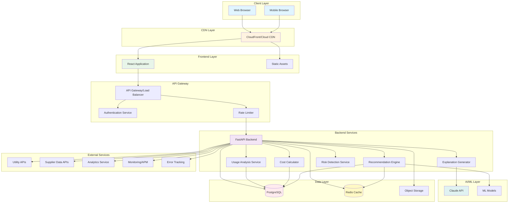
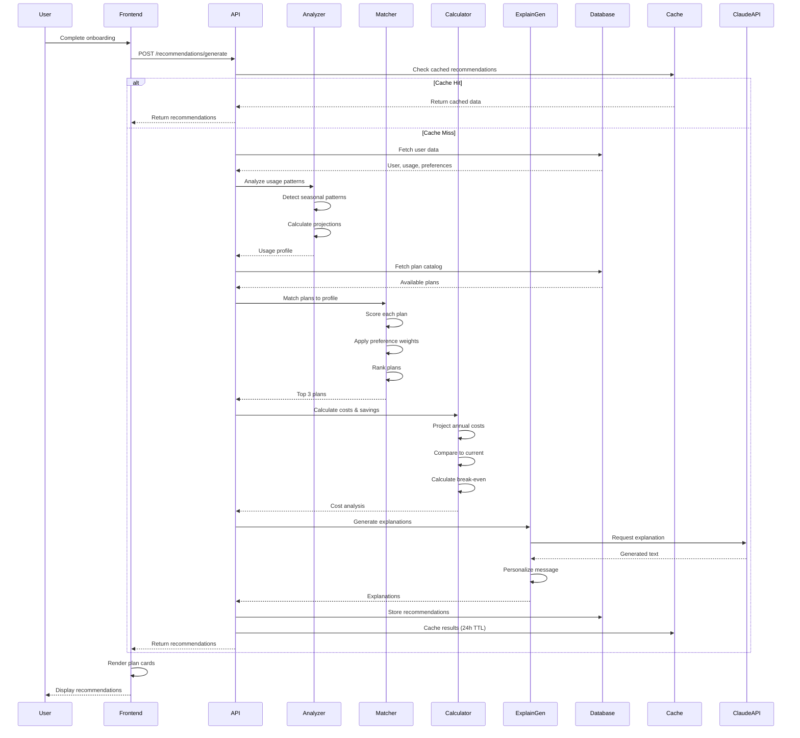
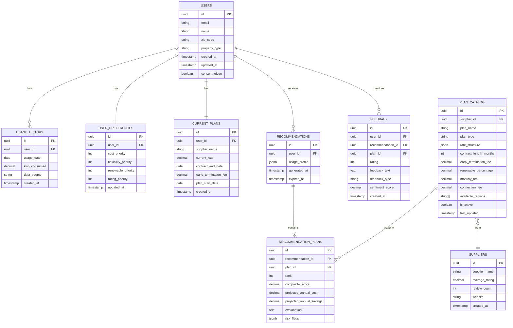
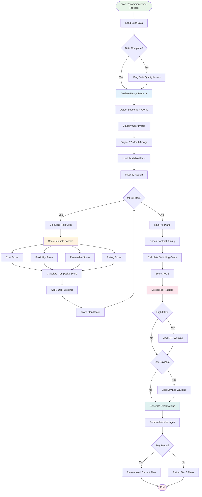
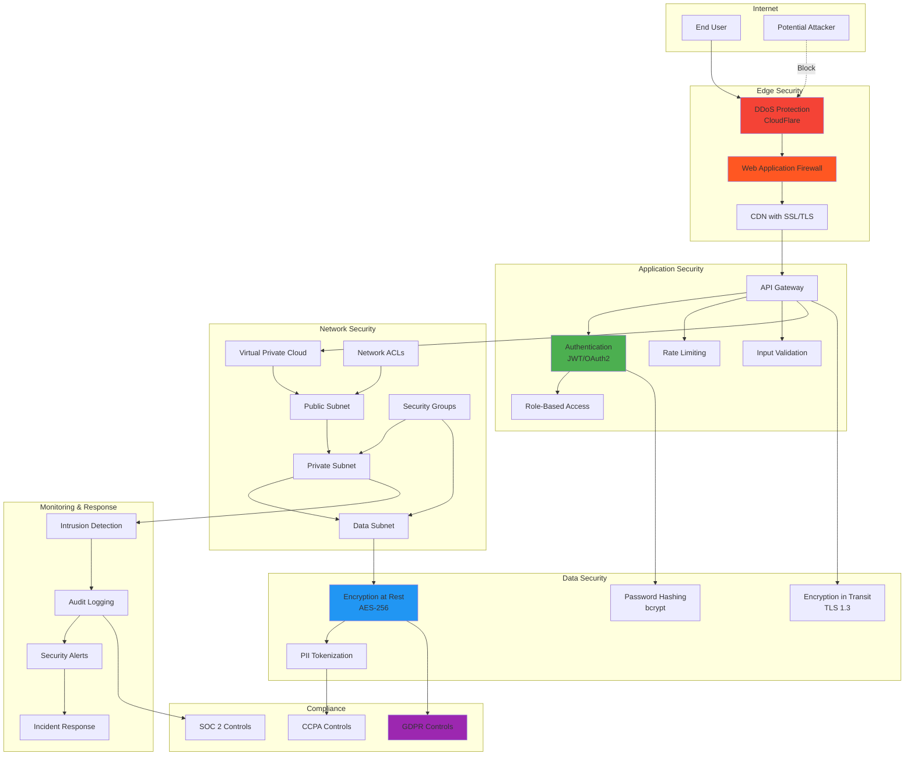
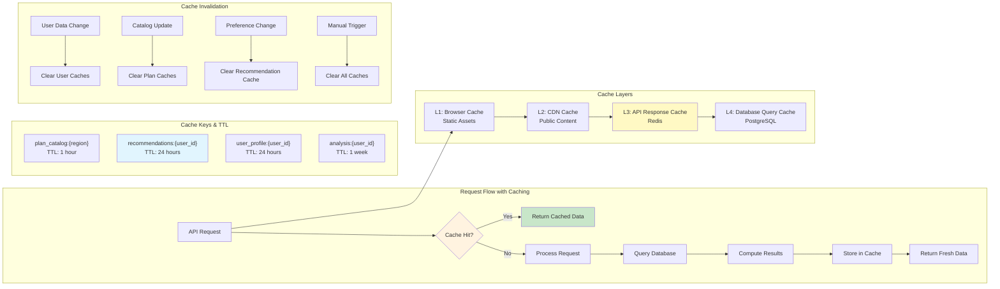
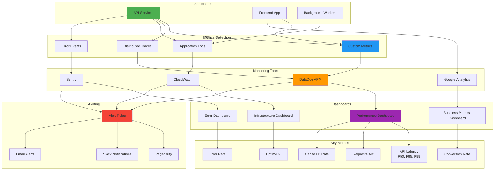
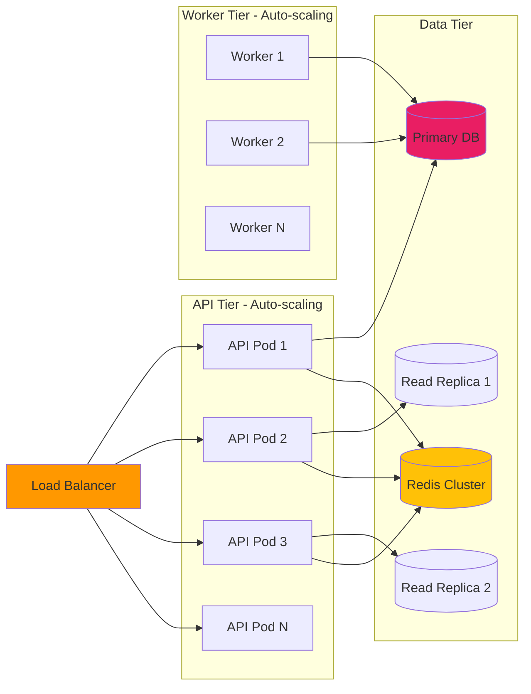

# AI Energy Plan Recommendation Agent - Architecture Diagrams

## System Architecture Overview



## Detailed Component Architecture

```mermaid
graph TB
    subgraph "Frontend Components"
        LANDING[Landing Page]
        ONBOARD[Onboarding Flow]
        PREFFORM[Preference Form]
        UPLOAD[Data Upload]
        RESULTS[Results Display]
        COMPARE[Comparison View]
        CHARTS[Visualization Charts]
    end

    subgraph "API Endpoints"
        AUTH_EP[/auth/*]
        USER_EP[/users/*]
        REC_EP[/recommendations/*]
        PLAN_EP[/plans/*]
        UPLOAD_EP[/usage/*]
        FEEDBACK_EP[/feedback/*]
    end

    subgraph "Business Logic Layer"
        subgraph "Core Engine"
            PROFILER[Usage Profiler]
            MATCHER[Plan Matcher]
            RANKER[Plan Ranker]
            SCORER[Scoring Algorithm]
        end
        
        subgraph "Calculators"
            COST_CALC[Cost Calculator]
            SAVINGS_CALC[Savings Calculator]
            BREAKEVEN[Break-even Analyzer]
        end
        
        subgraph "AI Services"
            NLG[Explanation Generator]
            PERSONALIZE[Personalization Engine]
        end
        
        subgraph "Safety"
            VALIDATOR[Data Validator]
            RISK_DETECT[Risk Detector]
            QUALITY[Data Quality Checker]
        end
    end

    subgraph "Data Access Layer"
        USER_DAO[User DAO]
        USAGE_DAO[Usage DAO]
        PLAN_DAO[Plan DAO]
        PREF_DAO[Preference DAO]
        CACHE_SERVICE[Cache Service]
    end

    subgraph "Data Storage"
        USER_DB[(Users Table)]
        USAGE_DB[(Usage History)]
        PLAN_DB[(Plan Catalog)]
        PREF_DB[(Preferences)]
        REC_DB[(Recommendations)]
        FEEDBACK_DB[(Feedback)]
        CACHE[(Redis)]
    end

    LANDING --> ONBOARD
    ONBOARD --> PREFFORM
    ONBOARD --> UPLOAD
    PREFFORM --> REC_EP
    UPLOAD --> UPLOAD_EP
    RESULTS --> COMPARE
    RESULTS --> CHARTS

    REC_EP --> PROFILER
    PROFILER --> MATCHER
    MATCHER --> RANKER
    RANKER --> SCORER
    
    SCORER --> COST_CALC
    COST_CALC --> SAVINGS_CALC
    SAVINGS_CALC --> BREAKEVEN
    
    RANKER --> NLG
    NLG --> PERSONALIZE
    
    PROFILER --> VALIDATOR
    RANKER --> RISK_DETECT
    VALIDATOR --> QUALITY

    PROFILER --> USAGE_DAO
    MATCHER --> PLAN_DAO
    SCORER --> PREF_DAO
    
    USAGE_DAO --> USAGE_DB
    PLAN_DAO --> PLAN_DB
    PREF_DAO --> PREF_DB
    USER_DAO --> USER_DB
    
    CACHE_SERVICE --> CACHE
    PLAN_DAO --> CACHE_SERVICE
    RANKER --> CACHE_SERVICE

    style LANDING fill:#e3f2fd
    style RESULTS fill:#e8f5e9
    style PROFILER fill:#fff3e0
    style MATCHER fill:#f3e5f5
    style NLG fill:#e0f2f1
    style CACHE fill:#fff9c4
```

## Data Flow Diagram - Recommendation Generation



## Database Schema Diagram



## Recommendation Algorithm Flow



## Deployment Architecture

```mermaid
graph TB
    subgraph "Production Environment - AWS/GCP"
        subgraph "Region: US-East"
            subgraph "Availability Zone 1"
                LB1[Load Balancer]
                API1[API Server 1]
                API2[API Server 2]
                WORKER1[Background Worker 1]
            end
            
            subgraph "Availability Zone 2"
                API3[API Server 3]
                API4[API Server 4]
                WORKER2[Background Worker 2]
            end
            
            subgraph "Managed Services"
                RDS[(RDS PostgreSQL<br/>Multi-AZ)]
                ELASTICACHE[(ElastiCache Redis<br/>Cluster Mode)]
                S3_PROD[S3 Bucket]
            end
        end
        
        subgraph "CDN & Edge"
            CLOUDFRONT[CloudFront Distribution]
            WAF[Web Application Firewall]
        end
        
        subgraph "Monitoring"
            CLOUDWATCH[CloudWatch]
            DATADOG[DataDog APM]
            SENTRY_PROD[Sentry]
        end
    end
    
    subgraph "Staging Environment"
        LB_STAGE[Load Balancer]
        API_STAGE[API Server]
        RDS_STAGE[(RDS PostgreSQL)]
        REDIS_STAGE[(Redis)]
    end
    
    subgraph "CI/CD Pipeline"
        GITHUB[GitHub Repository]
        ACTIONS[GitHub Actions]
        TEST[Automated Tests]
        BUILD[Build & Package]
        DEPLOY[Deploy to Staging]
        APPROVE[Manual Approval]
        PROD_DEPLOY[Deploy to Production]
    end
    
    subgraph "External Services"
        CLAUDE_API[Claude API]
        UTILITY_API[Utility APIs]
        SUPPLIER_API[Supplier APIs]
        ANALYTICS_EXT[Google Analytics]
    end
    
    CLOUDFRONT --> WAF
    WAF --> LB1
    LB1 --> API1
    LB1 --> API2
    LB1 --> API3
    LB1 --> API4
    
    API1 --> RDS
    API2 --> RDS
    API3 --> RDS
    API4 --> RDS
    
    API1 --> ELASTICACHE
    API2 --> ELASTICACHE
    API3 --> ELASTICACHE
    API4 --> ELASTICACHE
    
    API1 --> S3_PROD
    WORKER1 --> RDS
    WORKER2 --> RDS
    
    API1 --> CLOUDWATCH
    API1 --> DATADOG
    API1 --> SENTRY_PROD
    
    API1 --> CLAUDE_API
    API1 --> UTILITY_API
    API1 --> SUPPLIER_API
    
    GITHUB --> ACTIONS
    ACTIONS --> TEST
    TEST --> BUILD
    BUILD --> DEPLOY
    DEPLOY --> LB_STAGE
    LB_STAGE --> API_STAGE
    API_STAGE --> RDS_STAGE
    API_STAGE --> REDIS_STAGE
    
    DEPLOY --> APPROVE
    APPROVE --> PROD_DEPLOY
    PROD_DEPLOY --> LB1

    style CLOUDFRONT fill:#ff9800
    style RDS fill:#e91e63
    style ELASTICACHE fill:#ffc107
    style API1 fill:#4caf50
    style DATADOG fill:#2196f3
    style GITHUB fill:#333
```



## Security Architecture



## Caching Strategy



## Monitoring & Observability



## Integration Architecture

```mermaid
graph TB
    subgraph "Internal System"
        API[API Server]
        SCHEDULER[Job Scheduler]
        WEBHOOK[Webhook Handler]
    end
    
    subgraph "External Integrations"
        UTILITY[Utility Smart Meter API<br/>OAuth 2.0]
        SUPPLIER[Supplier Data Feed<br/>REST API]
        CLAUDE[Claude AI API<br/>API Key]
        PAYMENT[Payment Gateway<br/>Stripe (Future)]
    end
    
    subgraph "Analytics & Marketing"
        GA[Google Analytics<br/>Tracking]
        MIXPANEL[Mixpanel<br/>Events]
        MAILCHIMP[Email Marketing<br/>MailChimp]
        INTERCOM[Support Chat<br/>Intercom]
    end
    
    subgraph "Infrastructure Services"
        TWILIO[SMS Notifications<br/>Twilio]
        SENDGRID[Email Service<br/>SendGrid]
        S3_EXT[File Storage<br/>S3]
        CLOUDINARY[Image CDN<br/>Cloudinary]
    end
    
    subgraph "Integration Patterns"
        SYNC[Synchronous<br/>REST Calls]
        ASYNC[Asynchronous<br/>Job Queue]
        BATCH[Batch Processing<br/>Daily/Hourly]
        STREAM[Real-time<br/>Webhooks]
    end
    
    API --> UTILITY
    SCHEDULER --> SUPPLIER
    API --> CLAUDE
    
    API --> GA
    API --> MIXPANEL
    WEBHOOK --> MAILCHIMP
    API --> INTERCOM
    
    API --> TWILIO
    API --> SENDGRID
    API --> S3_EXT
    API --> CLOUDINARY
    
    API -.uses.-> SYNC
    SCHEDULER -.uses.-> ASYNC
    SCHEDULER -.uses.-> BATCH
    WEBHOOK -.uses.-> STREAM

    style UTILITY fill:#4caf50
    style CLAUDE fill:#00bcd4
    style GA fill:#ff9800
    style SYNC fill:#e1f5fe
    style ASYNC fill:#fff9c4
```

---

## Architecture Decision Records (ADRs)

### ADR-001: Database Choice - PostgreSQL
**Decision:** Use PostgreSQL as the primary database  
**Rationale:**
- Strong ACID compliance for transactional data
- Excellent JSON/JSONB support for flexible plan structures
- Mature ecosystem and tooling
- Good performance for read-heavy workloads
- Built-in full-text search capabilities

### ADR-002: Caching Strategy - Redis
**Decision:** Use Redis for distributed caching  
**Rationale:**
- In-memory performance for sub-millisecond response times
- Support for complex data structures
- Built-in TTL and expiration
- Widely supported and stable
- Good clustering support for scalability

### ADR-003: API Framework - FastAPI
**Decision:** Use FastAPI (Python) for backend API  
**Rationale:**
- Native async support for high concurrency
- Automatic API documentation (OpenAPI/Swagger)
- Strong typing with Pydantic
- Python ecosystem for ML/data science
- High performance comparable to Node.js

### ADR-004: Frontend Framework - React
**Decision:** Use React for frontend development  
**Rationale:**
- Large ecosystem and community
- Component reusability
- Strong accessibility support
- Good performance with virtual DOM
- Wide talent pool

### ADR-005: AI Service - Claude API
**Decision:** Use Claude API for explanation generation  
**Rationale:**
- Superior natural language generation
- Strong instruction-following
- Context window size supports full recommendation context
- Reliability and low latency
- Strong safety and alignment

### ADR-006: Cloud Provider - AWS or GCP
**Decision:** Use AWS or GCP (configurable)  
**Rationale:**
- Both provide comprehensive managed services
- Strong global infrastructure
- Good compliance certifications (GDPR, SOC 2)
- Mature monitoring and logging tools
- Competitive pricing with reserved instances

### ADR-007: Deployment Strategy - Containerized with Kubernetes
**Decision:** Use Docker containers with Kubernetes orchestration  
**Rationale:**
- Consistent environments across dev/stage/prod
- Easy horizontal scaling
- Rolling updates with zero downtime
- Resource isolation and limits
- Strong ecosystem (Helm, operators)

---

## Scalability Considerations

### Horizontal Scaling


### Performance Targets
- **API Response Time:** < 2 seconds (P95)
- **Page Load Time:** < 1 second
- **Concurrent Users:** 10,000+
- **Cache Hit Rate:** > 80%
- **Database Query Time:** < 100ms (P95)
- **Uptime SLA:** 99.9%

---

**End of Architecture Diagrams**

These diagrams provide comprehensive views of the system architecture from multiple perspectives: system overview, component details, data flow, deployment, security, and scalability.
