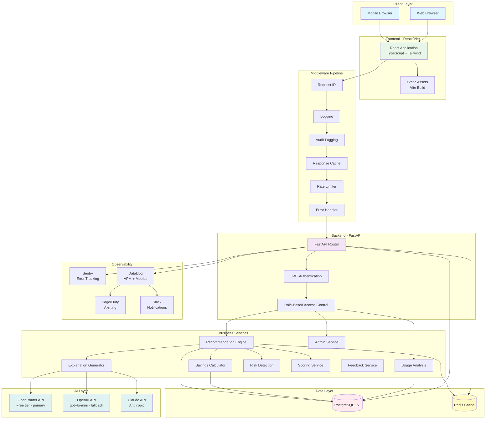
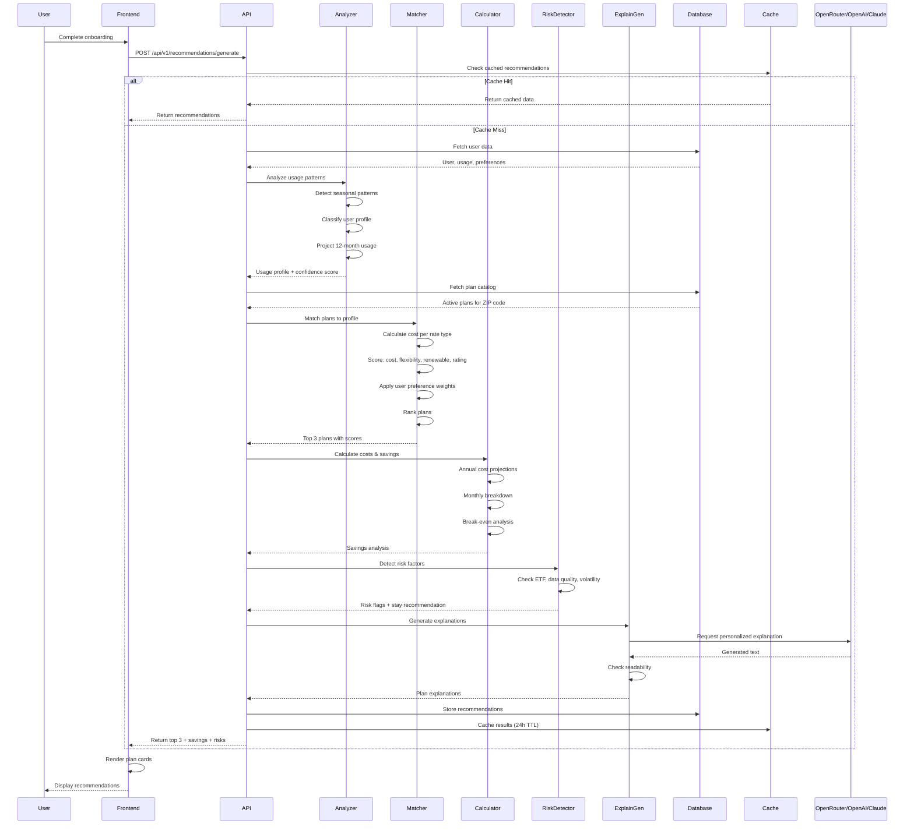
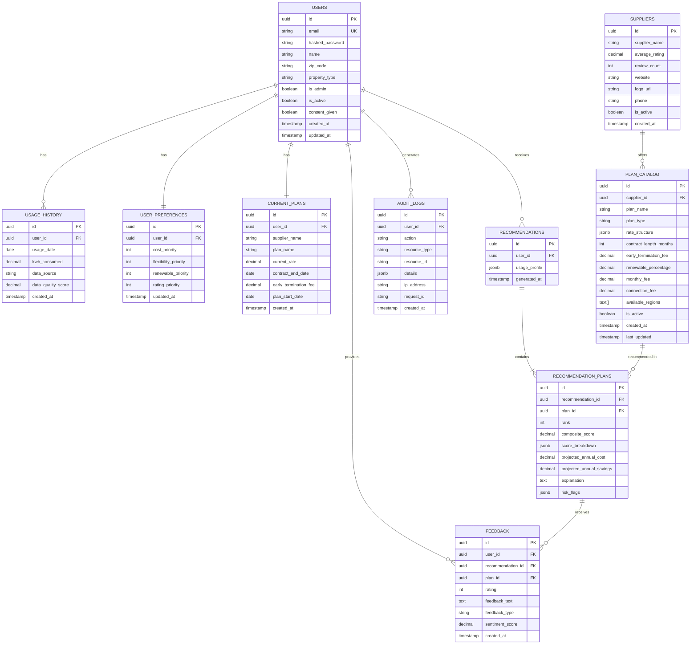
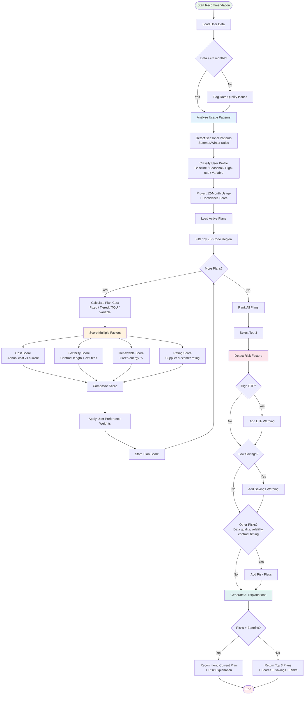
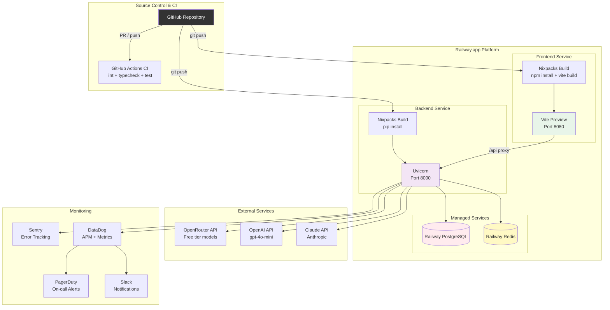
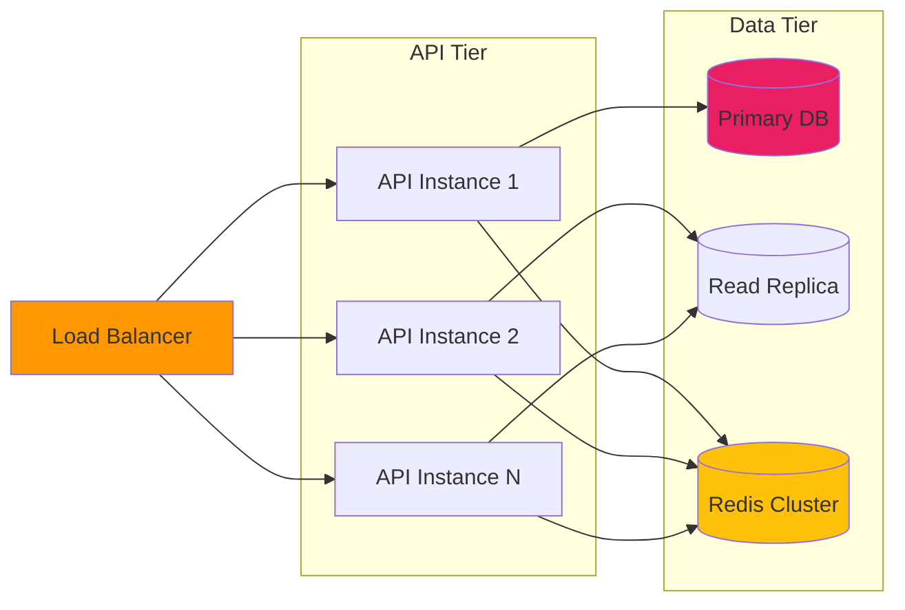
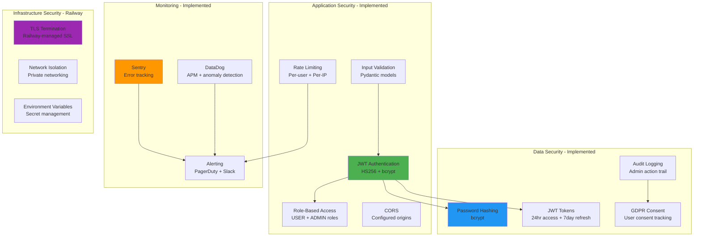
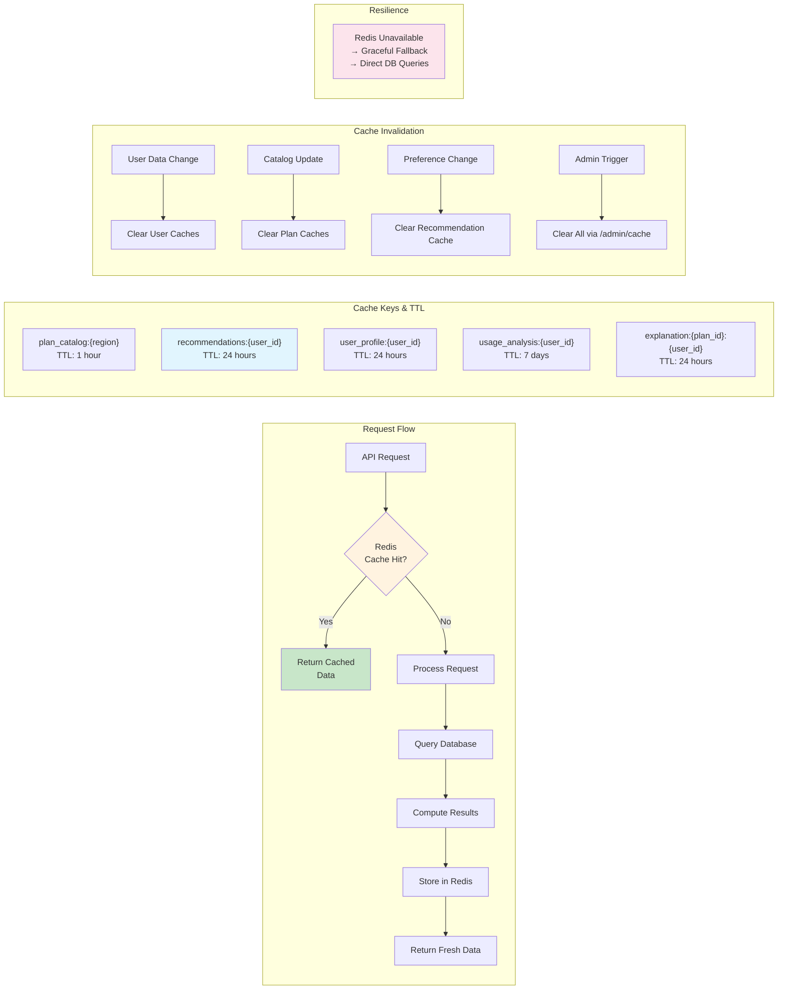
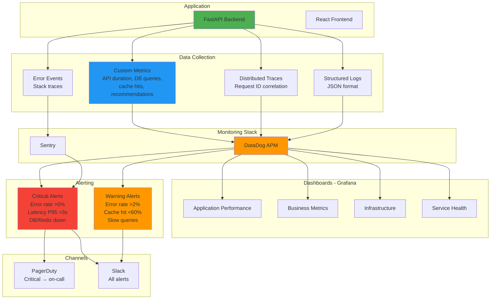

# TreeBeard - System Architecture

## System Architecture Overview


```mermaid
graph TB
    subgraph "Client Layer"
        WEB[Web Browser]
        MOBILE[Mobile Browser]
    end

    subgraph "Frontend - React/Vite"
        REACT[React Application<br/>TypeScript + Tailwind]
        STATIC[Static Assets<br/>Vite Build]
    end

    subgraph "Middleware Pipeline"
        REQID[Request ID]
        LOGGING[Logging]
        AUDIT[Audit Logging]
        CACHE_MW[Response Cache]
        RATELIMIT[Rate Limiter]
        ERRHANDLER[Error Handler]
    end

    subgraph "Backend - FastAPI"
        API[FastAPI Router]
        AUTH[JWT Authentication]
        RBAC[Role-Based Access Control]
    end

    subgraph "Business Services"
        RECOMMEND[Recommendation Engine]
        ANALYZE[Usage Analysis]
        EXPLAIN[Explanation Generator]
        CALC[Savings Calculator]
        RISK[Risk Detection]
        SCORE[Scoring Service]
        FEEDBACK_SVC[Feedback Service]
        ADMIN_SVC[Admin Service]
    end

    subgraph "AI Layer"
        OPENROUTER[OpenRouter API<br/>Free tier - primary]
        OPENAI[OpenAI API<br/>gpt-4o-mini - fallback]
        CLAUDE[Claude API<br/>Anthropic]
    end

    subgraph "Data Layer"
        POSTGRES[(PostgreSQL 15+)]
        REDIS[(Redis Cache)]
    end

    subgraph "Observability"
        SENTRY[Sentry<br/>Error Tracking]
        DATADOG[DataDog<br/>APM + Metrics]
        PAGERDUTY[PagerDuty<br/>Alerting]
        SLACK_ALERT[Slack<br/>Notifications]
    end

    WEB --> REACT
    MOBILE --> REACT
    REACT --> STATIC

    REACT --> REQID
    REQID --> LOGGING
    LOGGING --> AUDIT
    AUDIT --> CACHE_MW
    CACHE_MW --> RATELIMIT
    RATELIMIT --> ERRHANDLER
    ERRHANDLER --> API

    API --> AUTH
    AUTH --> RBAC
    RBAC --> RECOMMEND
    RBAC --> ANALYZE
    RBAC --> ADMIN_SVC

    RECOMMEND --> SCORE
    RECOMMEND --> CALC
    RECOMMEND --> RISK
    RECOMMEND --> EXPLAIN

    EXPLAIN --> OPENROUTER
    EXPLAIN --> OPENAI
    EXPLAIN --> CLAUDE

    API --> POSTGRES
    API --> REDIS
    ANALYZE --> POSTGRES
    CALC --> POSTGRES
    RECOMMEND --> POSTGRES
    RECOMMEND --> REDIS

    API --> SENTRY
    API --> DATADOG
    DATADOG --> PAGERDUTY
    DATADOG --> SLACK_ALERT

    style WEB fill:#e1f5ff
    style MOBILE fill:#e1f5ff
    style REACT fill:#e8f5e9
    style API fill:#f3e5f5
    style POSTGRES fill:#ffebee
    style REDIS fill:#fff9c4
    style OPENROUTER fill:#e0f2f1
    style OPENAI fill:#e0f2f1
    style CLAUDE fill:#e0f2f1
```

## Detailed Component Architecture

```mermaid
graph TB
    subgraph "Frontend Components"
        ONBOARD[Onboarding Flow<br/>4-step wizard]
        UPLOAD[File Upload<br/>CSV parser]
        PREFS[Preference Sliders<br/>Weighted priorities]
        RESULTS[Results Page<br/>Top 3 plans]
        COMPARE[Comparison View<br/>Side-by-side]
        CHARTS[Charts<br/>7 visualization types]
        SCENARIOS[Scenario Analysis<br/>What-if]
        ADMIN_UI[Admin Dashboard<br/>Users/Plans/Audit]
        FEEDBACK_UI[Feedback Widget]
        EXPORT[Export<br/>PDF/CSV]
    end

    subgraph "API Endpoints"
        AUTH_EP[/auth/*<br/>register, login, refresh]
        USER_EP[/users/*<br/>profile, preferences]
        REC_EP[/recommendations/*<br/>generate, retrieve]
        PLAN_EP[/plans/*<br/>catalog, details]
        UPLOAD_EP[/usage/*<br/>upload, history]
        FEEDBACK_EP[/feedback/*<br/>submit, analytics]
        ADMIN_EP[/admin/*<br/>users, plans, stats, audit]
        HEALTH_EP[/health<br/>readiness probe]
    end

    subgraph "Business Logic Layer"
        subgraph "Core Engine"
            PROFILER[Usage Profiler<br/>usage_analysis.py]
            MATCHER[Plan Matcher<br/>recommendation_engine.py]
            RANKER[Plan Ranker<br/>scoring_service.py]
        end

        subgraph "Calculators"
            COST_CALC[Cost Calculator<br/>4 rate types]
            SAVINGS_CALC[Savings Calculator<br/>savings_calculator.py]
            BREAKEVEN[Break-even Analyzer]
        end

        subgraph "AI Services"
            NLG_FACTORY[Explanation Factory<br/>explanation_service.py]
            NLG_OPENROUTER[OpenRouter Provider<br/>explanation_service_openai.py]
            NLG_TEMPLATE[Template Fallback<br/>explanation_templates.py]
        end

        subgraph "Safety & Quality"
            RISK_DETECT[Risk Detector<br/>risk_detection.py]
            QUALITY[Data Quality Checker]
        end
    end

    subgraph "Infrastructure Services"
        CACHE_SVC[Cache Service<br/>cache_service.py]
        CACHE_WARM[Cache Warming<br/>cache_warming.py]
        CACHE_OPT[Cache Optimization<br/>cache_optimization.py]
        ANALYTICS_SVC[Analytics Service<br/>analytics_service.py]
        AUDIT_SVC[Audit Service<br/>audit_service.py]
        FEEDBACK_SVC[Feedback Service<br/>feedback_service.py]
    end

    subgraph "Data Storage"
        USER_DB[(Users)]
        USAGE_DB[(Usage History)]
        PLAN_DB[(Plan Catalog)]
        PREF_DB[(Preferences)]
        REC_DB[(Recommendations)]
        FEEDBACK_DB[(Feedback)]
        AUDIT_DB[(Audit Logs)]
        CACHE[(Redis)]
    end

    ONBOARD --> AUTH_EP
    ONBOARD --> UPLOAD_EP
    PREFS --> USER_EP
    RESULTS --> REC_EP
    COMPARE --> PLAN_EP
    FEEDBACK_UI --> FEEDBACK_EP
    ADMIN_UI --> ADMIN_EP

    REC_EP --> PROFILER
    PROFILER --> MATCHER
    MATCHER --> RANKER

    RANKER --> COST_CALC
    COST_CALC --> SAVINGS_CALC
    SAVINGS_CALC --> BREAKEVEN

    RANKER --> NLG_FACTORY
    NLG_FACTORY --> NLG_OPENROUTER
    NLG_FACTORY --> NLG_TEMPLATE
    RANKER --> RISK_DETECT
    PROFILER --> QUALITY

    PROFILER --> USAGE_DB
    MATCHER --> PLAN_DB
    RANKER --> PREF_DB

    CACHE_SVC --> CACHE
    MATCHER --> CACHE_SVC
    RANKER --> CACHE_SVC

    style ONBOARD fill:#e3f2fd
    style RESULTS fill:#e8f5e9
    style PROFILER fill:#fff3e0
    style MATCHER fill:#f3e5f5
    style NLG_FACTORY fill:#e0f2f1
    style CACHE fill:#fff9c4
```

## Middleware Pipeline

Requests pass through 6 middleware layers in order before reaching route handlers:


```mermaid
flowchart LR
    REQ[Incoming<br/>Request] --> M1[RequestID<br/>Middleware]
    M1 --> M2[Logging<br/>Middleware]
    M2 --> M3[Audit<br/>Middleware]
    M3 --> M4[Cache<br/>Middleware]
    M4 --> M5[Rate Limit<br/>Middleware]
    M5 --> M6[Error Handler<br/>Middleware]
    M6 --> ROUTE[Route<br/>Handler]
    ROUTE --> RES[Response]

    style REQ fill:#e3f2fd
    style M1 fill:#fff3e0
    style M2 fill:#fff3e0
    style M3 fill:#fff3e0
    style M4 fill:#fff3e0
    style M5 fill:#fff3e0
    style M6 fill:#fff3e0
    style ROUTE fill:#e8f5e9
    style RES fill:#e8f5e9
```

| Middleware | Purpose | Details |
|-----------|---------|---------|
| **RequestID** | Tracing | Adds `X-Request-ID` header for distributed tracing |
| **Logging** | Observability | Logs all requests/responses with timing |
| **Audit** | Compliance | Records admin actions to audit_logs table |
| **Cache** | Performance | HTTP response caching (1hr plans, 24hr recommendations) |
| **Rate Limit** | Protection | 100 req/min per user, 1000 req/hr per IP |
| **Error Handler** | Reliability | Structured error responses, Sentry integration |

## Data Flow - Recommendation Generation


```mermaid
sequenceDiagram
    participant User
    participant Frontend
    participant API
    participant Analyzer
    participant Matcher
    participant Calculator
    participant RiskDetector
    participant ExplainGen
    participant Database
    participant Cache
    participant AI as OpenRouter/OpenAI/Claude

    User->>Frontend: Complete onboarding
    Frontend->>API: POST /api/v1/recommendations/generate

    API->>Cache: Check cached recommendations
    alt Cache Hit
        Cache-->>API: Return cached data
        API-->>Frontend: Return recommendations
    else Cache Miss
        API->>Database: Fetch user data
        Database-->>API: User, usage, preferences

        API->>Analyzer: Analyze usage patterns
        Analyzer->>Analyzer: Detect seasonal patterns
        Analyzer->>Analyzer: Classify user profile
        Analyzer->>Analyzer: Project 12-month usage
        Analyzer-->>API: Usage profile + confidence score

        API->>Database: Fetch plan catalog
        Database-->>API: Active plans for ZIP code

        API->>Matcher: Match plans to profile
        Matcher->>Matcher: Calculate cost per rate type
        Matcher->>Matcher: Score: cost, flexibility, renewable, rating
        Matcher->>Matcher: Apply user preference weights
        Matcher->>Matcher: Rank plans
        Matcher-->>API: Top 3 plans with scores

        API->>Calculator: Calculate costs & savings
        Calculator->>Calculator: Annual cost projections
        Calculator->>Calculator: Monthly breakdown
        Calculator->>Calculator: Break-even analysis
        Calculator-->>API: Savings analysis

        API->>RiskDetector: Detect risk factors
        RiskDetector->>RiskDetector: Check ETF, data quality, volatility
        RiskDetector-->>API: Risk flags + stay recommendation

        API->>ExplainGen: Generate explanations
        ExplainGen->>AI: Request personalized explanation
        AI-->>ExplainGen: Generated text
        ExplainGen->>ExplainGen: Check readability
        ExplainGen-->>API: Plan explanations

        API->>Database: Store recommendations
        API->>Cache: Cache results (24h TTL)
        API-->>Frontend: Return top 3 + savings + risks
    end

    Frontend->>Frontend: Render plan cards
    Frontend-->>User: Display recommendations
```

## Database Schema


```mermaid
erDiagram
    USERS ||--o{ USAGE_HISTORY : has
    USERS ||--|| USER_PREFERENCES : has
    USERS ||--|| CURRENT_PLANS : has
    USERS ||--o{ RECOMMENDATIONS : receives
    USERS ||--o{ FEEDBACK : provides
    USERS ||--o{ AUDIT_LOGS : generates

    RECOMMENDATIONS ||--|{ RECOMMENDATION_PLANS : contains
    PLAN_CATALOG ||--o{ RECOMMENDATION_PLANS : "recommended in"
    SUPPLIERS ||--o{ PLAN_CATALOG : offers
    RECOMMENDATION_PLANS ||--o{ FEEDBACK : receives

    USERS {
        uuid id PK
        string email UK
        string hashed_password
        string name
        string zip_code
        string property_type
        boolean is_admin
        boolean is_active
        boolean consent_given
        timestamp created_at
        timestamp updated_at
    }

    USER_PREFERENCES {
        uuid id PK
        uuid user_id FK
        int cost_priority
        int flexibility_priority
        int renewable_priority
        int rating_priority
        timestamp updated_at
    }

    CURRENT_PLANS {
        uuid id PK
        uuid user_id FK
        string supplier_name
        string plan_name
        decimal current_rate
        date contract_end_date
        decimal early_termination_fee
        date plan_start_date
        timestamp created_at
    }

    USAGE_HISTORY {
        uuid id PK
        uuid user_id FK
        date usage_date
        decimal kwh_consumed
        string data_source
        decimal data_quality_score
        timestamp created_at
    }

    SUPPLIERS {
        uuid id PK
        string supplier_name
        decimal average_rating
        int review_count
        string website
        string logo_url
        string phone
        boolean is_active
        timestamp created_at
    }

    PLAN_CATALOG {
        uuid id PK
        uuid supplier_id FK
        string plan_name
        string plan_type
        jsonb rate_structure
        int contract_length_months
        decimal early_termination_fee
        decimal renewable_percentage
        decimal monthly_fee
        decimal connection_fee
        text[] available_regions
        boolean is_active
        timestamp created_at
        timestamp last_updated
    }

    RECOMMENDATIONS {
        uuid id PK
        uuid user_id FK
        jsonb usage_profile
        timestamp generated_at
    }

    RECOMMENDATION_PLANS {
        uuid id PK
        uuid recommendation_id FK
        uuid plan_id FK
        int rank
        decimal composite_score
        jsonb score_breakdown
        decimal projected_annual_cost
        decimal projected_annual_savings
        text explanation
        jsonb risk_flags
    }

    FEEDBACK {
        uuid id PK
        uuid user_id FK
        uuid recommendation_id FK
        uuid plan_id FK
        int rating
        text feedback_text
        string feedback_type
        decimal sentiment_score
        timestamp created_at
    }

    AUDIT_LOGS {
        uuid id PK
        uuid user_id FK
        string action
        string resource_type
        string resource_id
        jsonb details
        string ip_address
        string request_id
        timestamp created_at
    }
```

### Rate Structure Types (JSONB)

The `plan_catalog.rate_structure` field supports four plan types:

```
Fixed:          { "type": "fixed", "rate_per_kwh": 0.12 }
Tiered:         { "type": "tiered", "tiers": [{ "limit": 500, "rate": 0.10 }, { "limit": null, "rate": 0.14 }] }
Time-of-Use:    { "type": "tou", "peak_rate": 0.15, "off_peak_rate": 0.08, "peak_hours": "2pm-8pm" }
Variable:       { "type": "variable", "base_rate": 0.11, "adjustment_factor": 0.02 }
```

## Recommendation Algorithm Flow


```mermaid
flowchart TD
    START([Start Recommendation]) --> LOAD_DATA[Load User Data]
    LOAD_DATA --> CHECK_DATA{Data >= 3 months?}

    CHECK_DATA -->|No| FLAG_QUALITY[Flag Data Quality Issues]
    CHECK_DATA -->|Yes| ANALYZE
    FLAG_QUALITY --> ANALYZE[Analyze Usage Patterns]

    ANALYZE --> SEASONAL[Detect Seasonal Patterns<br/>Summer/Winter ratios]
    SEASONAL --> CLASSIFY[Classify User Profile<br/>Baseline / Seasonal / High-use / Variable]
    CLASSIFY --> PROJECT[Project 12-Month Usage<br/>+ Confidence Score]

    PROJECT --> LOAD_PLANS[Load Active Plans]
    LOAD_PLANS --> FILTER[Filter by ZIP Code Region]

    FILTER --> SCORE_LOOP{More Plans?}
    SCORE_LOOP -->|Yes| CALC_COST[Calculate Plan Cost<br/>Fixed / Tiered / TOU / Variable]
    CALC_COST --> SCORE_FACTORS[Score Multiple Factors]

    SCORE_FACTORS --> COST_SCORE[Cost Score<br/>Annual cost vs current]
    SCORE_FACTORS --> FLEX_SCORE[Flexibility Score<br/>Contract length + exit fees]
    SCORE_FACTORS --> RENEW_SCORE[Renewable Score<br/>Green energy %]
    SCORE_FACTORS --> RATING_SCORE[Rating Score<br/>Supplier customer rating]

    COST_SCORE --> COMPOSITE[Composite Score]
    FLEX_SCORE --> COMPOSITE
    RENEW_SCORE --> COMPOSITE
    RATING_SCORE --> COMPOSITE

    COMPOSITE --> WEIGHT[Apply User Preference Weights]
    WEIGHT --> STORE_SCORE[Store Plan Score]
    STORE_SCORE --> SCORE_LOOP

    SCORE_LOOP -->|No| RANK[Rank All Plans]
    RANK --> SELECT_TOP[Select Top 3]

    SELECT_TOP --> DETECT_RISK[Detect Risk Factors]
    DETECT_RISK --> HIGH_ETF{High ETF?}
    HIGH_ETF -->|Yes| ADD_WARNING[Add ETF Warning]
    HIGH_ETF -->|No| LOW_SAVINGS

    ADD_WARNING --> LOW_SAVINGS{Low Savings?}
    LOW_SAVINGS -->|Yes| ADD_WARNING2[Add Savings Warning]
    LOW_SAVINGS -->|No| MORE_RISKS

    ADD_WARNING2 --> MORE_RISKS{Other Risks?<br/>Data quality, volatility,<br/>contract timing}
    MORE_RISKS -->|Yes| ADD_MORE[Add Risk Flags]
    MORE_RISKS -->|No| GEN_EXPLAIN

    ADD_MORE --> GEN_EXPLAIN[Generate AI Explanations]
    GEN_EXPLAIN --> CHECK_STAY{Risks > Benefits?}

    CHECK_STAY -->|Yes| RECOMMEND_STAY[Recommend Current Plan<br/>+ Risk Explanation]
    CHECK_STAY -->|No| RETURN_RECS[Return Top 3 Plans<br/>+ Scores + Savings + Risks]

    RECOMMEND_STAY --> END([End])
    RETURN_RECS --> END

    style START fill:#e8f5e9
    style END fill:#ffebee
    style ANALYZE fill:#e3f2fd
    style SCORE_FACTORS fill:#fff3e0
    style DETECT_RISK fill:#fce4ec
    style GEN_EXPLAIN fill:#e0f2f1
```

## Deployment Architecture

The application currently deploys to **Railway.app** using Nixpacks builds:


```mermaid
graph TB
    subgraph "Railway.app Platform"
        subgraph "Frontend Service"
            FE_BUILD[Nixpacks Build<br/>npm install + vite build]
            FE_SERVE[Vite Preview<br/>Port 8080]
        end

        subgraph "Backend Service"
            BE_BUILD[Nixpacks Build<br/>pip install]
            BE_SERVE[Uvicorn<br/>Port 8000]
        end

        subgraph "Managed Services"
            RW_PG[(Railway PostgreSQL)]
            RW_REDIS[(Railway Redis)]
        end
    end

    subgraph "External Services"
        OPENROUTER_API[OpenRouter API<br/>Free tier models]
        OPENAI_API[OpenAI API<br/>gpt-4o-mini]
        CLAUDE_API[Claude API<br/>Anthropic]
    end

    subgraph "Monitoring"
        SENTRY[Sentry<br/>Error Tracking]
        DATADOG[DataDog<br/>APM + Metrics]
        PAGERDUTY[PagerDuty<br/>On-call Alerts]
        SLACK[Slack<br/>Notifications]
    end

    subgraph "Source Control & CI"
        GITHUB[GitHub Repository]
        CI[GitHub Actions CI<br/>lint + typecheck + test]
    end

    GITHUB -->|PR / push| CI
    GITHUB -->|git push| FE_BUILD
    GITHUB -->|git push| BE_BUILD
    FE_BUILD --> FE_SERVE
    BE_BUILD --> BE_SERVE

    FE_SERVE -->|/api proxy| BE_SERVE

    BE_SERVE --> RW_PG
    BE_SERVE --> RW_REDIS

    BE_SERVE --> OPENROUTER_API
    BE_SERVE --> OPENAI_API
    BE_SERVE --> CLAUDE_API

    BE_SERVE --> SENTRY
    BE_SERVE --> DATADOG
    DATADOG --> PAGERDUTY
    DATADOG --> SLACK

    style FE_SERVE fill:#e8f5e9
    style BE_SERVE fill:#f3e5f5
    style RW_PG fill:#ffebee
    style RW_REDIS fill:#fff9c4
    style GITHUB fill:#333,color:#fff
```

### Future Scaling Path

For production scale, the architecture is designed to migrate to cloud infrastructure:


```mermaid
graph LR
    LB[Load Balancer]

    subgraph "API Tier"
        API1[API Instance 1]
        API2[API Instance 2]
        APIN[API Instance N]
    end

    subgraph "Data Tier"
        PRIMARY[(Primary DB)]
        REPLICA[(Read Replica)]
        CACHE[(Redis Cluster)]
    end

    LB --> API1
    LB --> API2
    LB --> APIN

    API1 --> PRIMARY
    API2 --> REPLICA
    APIN --> REPLICA

    API1 --> CACHE
    API2 --> CACHE
    APIN --> CACHE

    style LB fill:#ff9800
    style PRIMARY fill:#e91e63
    style CACHE fill:#ffc107
```

## Security Architecture


```mermaid
graph TB
    subgraph "Application Security - Implemented"
        AUTH[JWT Authentication<br/>HS256 + bcrypt]
        RATELIMIT[Rate Limiting<br/>Per-user + Per-IP]
        INPUTVAL[Input Validation<br/>Pydantic models]
        RBAC[Role-Based Access<br/>USER + ADMIN roles]
        CORS_SEC[CORS<br/>Configured origins]
    end

    subgraph "Data Security - Implemented"
        HASH[Password Hashing<br/>bcrypt]
        TOKEN[JWT Tokens<br/>24hr access + 7day refresh]
        AUDIT[Audit Logging<br/>Admin action trail]
        CONSENT[GDPR Consent<br/>User consent tracking]
    end

    subgraph "Monitoring - Implemented"
        SENTRY[Sentry<br/>Error tracking]
        DATADOG_SEC[DataDog<br/>APM + anomaly detection]
        ALERT_SEC[Alerting<br/>PagerDuty + Slack]
    end

    subgraph "Infrastructure Security - Railway"
        RAILWAY_TLS[TLS Termination<br/>Railway-managed SSL]
        RAILWAY_ISO[Network Isolation<br/>Private networking]
        ENV_VARS[Environment Variables<br/>Secret management]
    end

    AUTH --> RBAC
    AUTH --> TOKEN
    AUTH --> HASH
    RATELIMIT --> ALERT_SEC
    INPUTVAL --> AUTH
    AUDIT --> CONSENT
    SENTRY --> ALERT_SEC
    DATADOG_SEC --> ALERT_SEC

    style AUTH fill:#4caf50
    style HASH fill:#2196f3
    style SENTRY fill:#ff9800
    style RAILWAY_TLS fill:#9c27b0
```

## Caching Strategy


```mermaid
graph LR
    subgraph "Request Flow"
        REQ[API Request] --> CHECK_CACHE{Redis<br/>Cache Hit?}

        CHECK_CACHE -->|Yes| RETURN_CACHED[Return Cached<br/>Data]
        CHECK_CACHE -->|No| PROCESS[Process Request]

        PROCESS --> QUERY_DB[Query Database]
        QUERY_DB --> COMPUTE[Compute Results]
        COMPUTE --> STORE_CACHE[Store in Redis]
        STORE_CACHE --> RETURN_FRESH[Return Fresh Data]
    end

    subgraph "Cache Keys & TTL"
        KEY1["plan_catalog:{region}<br/>TTL: 1 hour"]
        KEY2["recommendations:{user_id}<br/>TTL: 24 hours"]
        KEY3["user_profile:{user_id}<br/>TTL: 24 hours"]
        KEY4["usage_analysis:{user_id}<br/>TTL: 7 days"]
        KEY5["explanation:{plan_id}:{user_id}<br/>TTL: 24 hours"]
    end

    subgraph "Cache Invalidation"
        INV1[User Data Change] --> CLEAR1[Clear User Caches]
        INV2[Catalog Update] --> CLEAR2[Clear Plan Caches]
        INV3[Preference Change] --> CLEAR3[Clear Recommendation Cache]
        INV4[Admin Trigger] --> CLEAR4[Clear All via /admin/cache]
    end

    subgraph "Resilience"
        FALLBACK[Redis Unavailable<br/>→ Graceful Fallback<br/>→ Direct DB Queries]
    end

    style CHECK_CACHE fill:#fff3e0
    style RETURN_CACHED fill:#c8e6c9
    style KEY2 fill:#e1f5fe
    style FALLBACK fill:#fce4ec
```

## Monitoring & Observability


```mermaid
graph TB
    subgraph "Application"
        API[FastAPI Backend]
        FRONTEND[React Frontend]
    end

    subgraph "Data Collection"
        METRICS[Custom Metrics<br/>API duration, DB queries,<br/>cache hits, recommendations]
        TRACES[Distributed Traces<br/>Request ID correlation]
        LOGS[Structured Logs<br/>JSON format]
        ERRORS[Error Events<br/>Stack traces]
    end

    subgraph "Monitoring Stack"
        APM[DataDog APM]
        SENTRY[Sentry]
    end

    subgraph "Dashboards - Grafana"
        PERF_DASH[Application Performance]
        BIZ_DASH[Business Metrics]
        INFRA_DASH[Infrastructure]
        HEALTH_DASH[Service Health]
    end

    subgraph "Alerting"
        CRITICAL[Critical Alerts<br/>Error rate >5%<br/>Latency P95 >3s<br/>DB/Redis down]
        WARNING[Warning Alerts<br/>Error rate >2%<br/>Cache hit <60%<br/>Slow queries]
    end

    subgraph "Channels"
        PD[PagerDuty<br/>Critical → on-call]
        SL[Slack<br/>All alerts]
    end

    API --> METRICS
    API --> TRACES
    API --> LOGS
    API --> ERRORS

    METRICS --> APM
    TRACES --> APM
    ERRORS --> SENTRY
    LOGS --> APM

    APM --> PERF_DASH
    APM --> BIZ_DASH
    APM --> INFRA_DASH
    APM --> HEALTH_DASH

    APM --> CRITICAL
    SENTRY --> CRITICAL
    APM --> WARNING

    CRITICAL --> PD
    CRITICAL --> SL
    WARNING --> SL

    style API fill:#4caf50
    style METRICS fill:#2196f3
    style APM fill:#ff9800
    style CRITICAL fill:#f44336
    style WARNING fill:#ff9800
```

---

## Architecture Decision Records (ADRs)

### ADR-001: Database - PostgreSQL
**Decision:** PostgreSQL as the primary database
- ACID compliance for transactional data
- JSONB support for flexible plan rate structures
- Array types for region filtering (`available_regions text[]`)
- GIN indexes for efficient array containment queries
- Mature migration tooling (Alembic)

### ADR-002: Cache - Redis
**Decision:** Redis for distributed caching with graceful fallback
- Sub-millisecond response times for cached data
- Built-in TTL and key expiration
- Graceful degradation when unavailable (direct DB queries)
- Cache warming for frequently accessed data

### ADR-003: API Framework - FastAPI
**Decision:** FastAPI (Python) for the backend API
- Native async support for high concurrency
- Automatic OpenAPI/Swagger documentation
- Strong typing with Pydantic validation
- Python ecosystem for data processing (Pandas, NumPy, SciPy)
- Middleware pipeline for cross-cutting concerns

### ADR-004: Frontend - React + Vite
**Decision:** React 18 with TypeScript and Vite
- Component-based architecture for complex UI (onboarding wizard, comparison views, charts)
- Vite for fast development builds and optimized production bundles
- Tailwind CSS for consistent design system
- Code splitting by vendor (react, UI, charts) for cache efficiency

### ADR-005: AI Explanations - Multi-Provider with Factory Pattern
**Decision:** Support OpenRouter, OpenAI, and Claude via `create_explanation_service()` factory
- OpenRouter (free tier, e.g. `google/gemini-2.0-flash-exp:free`) as primary provider for demo
- OpenAI (gpt-4o-mini) as fallback when OpenRouter not configured
- Claude API integration available
- Template-based fallback when no API keys are set
- Provider resolution priority: explicit args > OpenRouter > OpenAI > template
- Readability scoring (Fleisch-Kincaid) for explanation quality
- 24-hour caching to minimize API costs

### ADR-006: Deployment - Railway.app
**Decision:** Railway.app with Nixpacks builds for MVP deployment
- Simple git-push deployment workflow
- Managed PostgreSQL and Redis services
- Automatic TLS termination
- Environment variable management
- Designed for future migration to AWS/GCP for production scale

---

## Performance Targets

| Metric | Target |
|--------|--------|
| API Response Time | < 2 seconds (P95) |
| Page Load Time | < 1 second |
| Cache Hit Rate | > 80% |
| Database Query Time | < 100ms (P95) |
| Slow Query Threshold | > 100ms (logged) |
| Concurrent Users | 10,000+ |
| Uptime SLA | 99.9% |

## CI/CD Pipeline

**GitHub Actions** (`.github/workflows/ci.yml`) runs on every PR and push to `main`:

| Job | Steps |
|-----|-------|
| **Backend** | Install deps, Ruff lint, Black format check, MyPy typecheck, pytest |
| **Frontend** | Install deps, ESLint, TypeScript `tsc --noEmit`, Vitest |

**Pre-commit hooks** (`.pre-commit-config.yaml`) enforce the same checks locally:
- Ruff lint + format (Python)
- MyPy type checking (Python)
- ESLint + Prettier (Frontend)
- File hygiene (trailing whitespace, end-of-file, YAML/JSON validation)

## Key Configuration

| Setting | Default | Source |
|---------|---------|--------|
| Database Pool | 5 connections + 10 overflow | `config/settings.py` |
| Pool Recycle | 3600s (1 hour) | `config/database.py` |
| JWT Expiry | 24 hours | `config/settings.py` |
| Cache TTL | 24 hours | `config/settings.py` |
| Rate Limit (user) | 100 req/min | Middleware config |
| Rate Limit (IP) | 1000 req/hr | Middleware config |
| Max Recommendations | 3 | `config/settings.py` |
| Min Usage Data | 3 months | `config/settings.py` |
| Preferred Usage Data | 12 months | `config/settings.py` |
