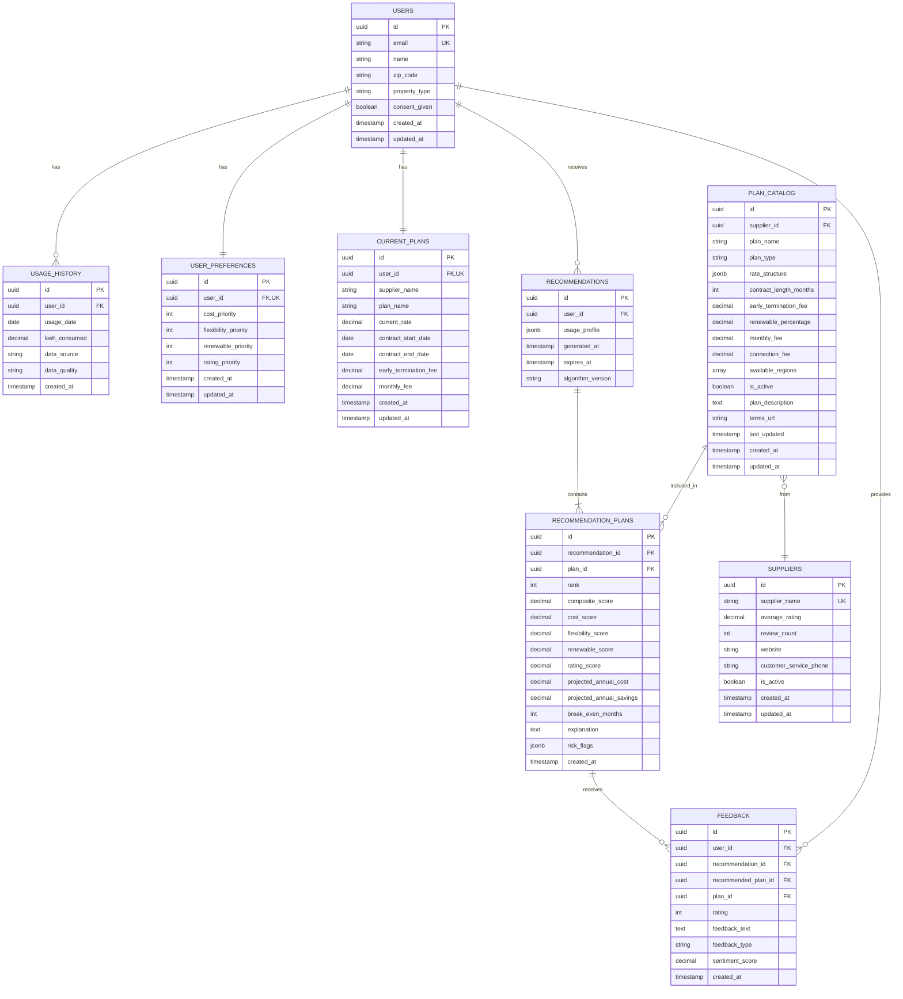

# TreeBeard Database Schema Documentation

**Version:** 1.0.0
**Last Updated:** November 10, 2025
**Story:** 1.1 - Database Schema Design
**Database:** PostgreSQL 15+

## Overview

This document describes the complete database schema for the TreeBeard Energy Plan Recommendation System. The schema is designed to support:

- User management and preferences
- Energy usage tracking and analysis
- Plan catalog with flexible rate structures
- Recommendation generation and storage
- User feedback collection

## Entity Relationship Diagram



## Table Descriptions

### 1. users

Stores user profile information and consent.

**Design Decision:** Minimal user information stored. ZIP code is critical for regional plan filtering.

| Column | Type | Constraints | Description |
|--------|------|-------------|-------------|
| id | UUID | PK | Unique identifier |
| email | VARCHAR(255) | NOT NULL, UNIQUE | User's email address |
| name | VARCHAR(255) | NOT NULL | User's full name |
| zip_code | VARCHAR(10) | NOT NULL, INDEXED | ZIP code for regional availability |
| property_type | VARCHAR(50) | NOT NULL | residential, commercial, etc. |
| consent_given | BOOLEAN | NOT NULL, DEFAULT TRUE | GDPR/CCPA consent |
| created_at | TIMESTAMP | NOT NULL | Record creation time |
| updated_at | TIMESTAMP | NOT NULL | Last update time |

**Indexes:**
- `idx_users_email` on `email`
- `idx_users_zip_code` on `zip_code`

---

### 2. user_preferences

User preferences for recommendation algorithm weighting.

**Design Decision:** Store as integer weights (0-100) for easier validation. Normalized during scoring.

| Column | Type | Constraints | Description |
|--------|------|-------------|-------------|
| id | UUID | PK | Unique identifier |
| user_id | UUID | FK(users.id), UNIQUE | Reference to user |
| cost_priority | INTEGER | NOT NULL, DEFAULT 40 | Cost weight (0-100) |
| flexibility_priority | INTEGER | NOT NULL, DEFAULT 30 | Flexibility weight (0-100) |
| renewable_priority | INTEGER | NOT NULL, DEFAULT 20 | Renewable weight (0-100) |
| rating_priority | INTEGER | NOT NULL, DEFAULT 10 | Rating weight (0-100) |
| created_at | TIMESTAMP | NOT NULL | Record creation time |
| updated_at | TIMESTAMP | NOT NULL | Last update time |

**Indexes:**
- `idx_user_preferences_user_id` on `user_id`

**Default Weights (from PRD):**
- Cost: 40%
- Flexibility: 30%
- Renewable: 20%
- Rating: 10%

---

### 3. current_plans

User's current energy plan for comparison.

**Design Decision:** Separate table to support historical tracking and plan changes.

| Column | Type | Constraints | Description |
|--------|------|-------------|-------------|
| id | UUID | PK | Unique identifier |
| user_id | UUID | FK(users.id), UNIQUE | Reference to user |
| supplier_name | VARCHAR(255) | NOT NULL | Current supplier name |
| plan_name | VARCHAR(255) | NULL | Current plan name |
| current_rate | NUMERIC(10,4) | NOT NULL | Rate in cents per kWh |
| contract_start_date | DATE | NULL | Contract start date |
| contract_end_date | DATE | NOT NULL, INDEXED | Contract end date |
| early_termination_fee | NUMERIC(10,2) | NOT NULL, DEFAULT 0.00 | ETF in dollars |
| monthly_fee | NUMERIC(10,2) | NULL | Monthly base fee |
| created_at | TIMESTAMP | NOT NULL | Record creation time |
| updated_at | TIMESTAMP | NOT NULL | Last update time |

**Indexes:**
- `idx_current_plans_user_id` on `user_id`
- `idx_current_plans_contract_end_date` on `contract_end_date`

---

### 4. usage_history

Daily energy usage tracking.

**Design Decision:** Daily granularity supports seasonal analysis, peak/off-peak detection, and flexible aggregation. PRD specifies "12 months minimum, daily preferred."

| Column | Type | Constraints | Description |
|--------|------|-------------|-------------|
| id | UUID | PK | Unique identifier |
| user_id | UUID | FK(users.id) | Reference to user |
| usage_date | DATE | NOT NULL, INDEXED | Date of usage |
| kwh_consumed | NUMERIC(12,3) | NOT NULL | kWh consumed |
| data_source | VARCHAR(50) | NOT NULL, DEFAULT 'upload' | upload, api, manual |
| data_quality | VARCHAR(50) | NULL | complete, estimated, partial |
| created_at | TIMESTAMP | NOT NULL | Record creation time |

**Indexes:**
- `idx_usage_history_user_date` on `(user_id, usage_date)` - Composite for efficient queries
- `idx_usage_history_unique_user_date` on `(user_id, usage_date)` - UNIQUE to prevent duplicates
- `idx_usage_history_date` on `usage_date` - For date range queries

---

### 5. suppliers

Energy supplier information and ratings.

**Design Decision:** Separate from plans to avoid duplication and support supplier-level analytics.

| Column | Type | Constraints | Description |
|--------|------|-------------|-------------|
| id | UUID | PK | Unique identifier |
| supplier_name | VARCHAR(255) | NOT NULL, UNIQUE | Supplier name |
| average_rating | NUMERIC(3,2) | NULL | Rating (0.00-5.00) |
| review_count | INTEGER | NOT NULL, DEFAULT 0 | Number of reviews |
| website | VARCHAR(500) | NULL | Supplier website URL |
| customer_service_phone | VARCHAR(20) | NULL | Customer service phone |
| is_active | BOOLEAN | NOT NULL, DEFAULT TRUE | Active status |
| created_at | TIMESTAMP | NOT NULL | Record creation time |
| updated_at | TIMESTAMP | NOT NULL | Last update time |

**Indexes:**
- `idx_suppliers_name` on `supplier_name`
- `idx_suppliers_active` on `is_active`

---

### 6. plan_catalog

Available energy plans with all attributes.

**Design Decision:** JSONB for rate_structure supports multiple rate types (fixed, tiered, time-of-use, variable) without complex normalization.

| Column | Type | Constraints | Description |
|--------|------|-------------|-------------|
| id | UUID | PK | Unique identifier |
| supplier_id | UUID | FK(suppliers.id) | Reference to supplier |
| plan_name | VARCHAR(255) | NOT NULL, INDEXED | Plan name |
| plan_type | VARCHAR(50) | NOT NULL, INDEXED | fixed, variable, indexed, tiered |
| rate_structure | JSONB | NOT NULL | Rate details (flexible schema) |
| contract_length_months | INTEGER | NOT NULL, INDEXED | Contract length (0=month-to-month) |
| early_termination_fee | NUMERIC(10,2) | NOT NULL, DEFAULT 0.00 | ETF in dollars |
| renewable_percentage | NUMERIC(5,2) | NOT NULL, DEFAULT 0.00, INDEXED | Renewable % (0-100) |
| monthly_fee | NUMERIC(10,2) | NULL | Monthly base fee |
| connection_fee | NUMERIC(10,2) | NULL | One-time connection fee |
| available_regions | TEXT[] | NOT NULL | Array of ZIP codes/regions |
| is_active | BOOLEAN | NOT NULL, DEFAULT TRUE | Active status |
| plan_description | TEXT | NULL | Marketing description |
| terms_url | VARCHAR(500) | NULL | Terms and conditions URL |
| last_updated | TIMESTAMP | NOT NULL | Last update time |
| created_at | TIMESTAMP | NOT NULL | Record creation time |
| updated_at | TIMESTAMP | NOT NULL | Last update time |

**Indexes:**
- `idx_plan_catalog_supplier_active` on `(supplier_id, is_active)` - Composite
- `idx_plan_catalog_type_length` on `(plan_type, contract_length_months)` - Composite
- `idx_plan_catalog_renewable` on `renewable_percentage`
- `idx_plan_catalog_regions` on `available_regions` - GIN index for array searches

**Rate Structure Examples:**

```json
// Fixed rate
{
  "type": "fixed",
  "rate_per_kwh": 12.5
}

// Tiered rate
{
  "type": "tiered",
  "tiers": [
    {"usage_max": 500, "rate_per_kwh": 10.0},
    {"usage_max": 1000, "rate_per_kwh": 12.0},
    {"usage_max": null, "rate_per_kwh": 14.0}
  ]
}

// Time-of-use
{
  "type": "time_of_use",
  "peak_rate": 15.0,
  "off_peak_rate": 8.0,
  "peak_hours": [8, 9, 10, 11, 12, 13, 14, 15, 16, 17, 18, 19, 20]
}
```

---

### 7. recommendations

Recommendation sessions with usage analysis context.

**Design Decision:** Store usage_profile as JSONB to capture analyzed patterns without duplicating usage_history.

| Column | Type | Constraints | Description |
|--------|------|-------------|-------------|
| id | UUID | PK | Unique identifier |
| user_id | UUID | FK(users.id) | Reference to user |
| usage_profile | JSONB | NOT NULL | Analyzed usage patterns |
| generated_at | TIMESTAMP | NOT NULL, INDEXED | Generation time |
| expires_at | TIMESTAMP | NOT NULL, INDEXED | Expiration time |
| algorithm_version | TEXT | NOT NULL, DEFAULT '1.0.0' | Algorithm version |

**Indexes:**
- `idx_recommendations_user_generated` on `(user_id, generated_at)` - Composite
- `idx_recommendations_expires` on `expires_at`

---

### 8. recommendation_plans

Top 3 recommended plans per recommendation.

**Design Decision:** Separate rows for each plan allow easy querying and historical tracking. Risk flags in JSONB support multiple warning types.

| Column | Type | Constraints | Description |
|--------|------|-------------|-------------|
| id | UUID | PK | Unique identifier |
| recommendation_id | UUID | FK(recommendations.id) | Reference to recommendation |
| plan_id | UUID | FK(plan_catalog.id) | Reference to plan |
| rank | INTEGER | NOT NULL | Rank (1=best, 2, 3) |
| composite_score | NUMERIC(10,4) | NOT NULL | Final weighted score (0-100) |
| cost_score | NUMERIC(10,4) | NOT NULL | Cost component (0-100) |
| flexibility_score | NUMERIC(10,4) | NOT NULL | Flexibility component (0-100) |
| renewable_score | NUMERIC(10,4) | NOT NULL | Renewable component (0-100) |
| rating_score | NUMERIC(10,4) | NOT NULL | Rating component (0-100) |
| projected_annual_cost | NUMERIC(12,2) | NOT NULL | Projected cost in dollars |
| projected_annual_savings | NUMERIC(12,2) | NOT NULL | Savings in dollars |
| break_even_months | INTEGER | NULL | Months to break even |
| explanation | TEXT | NOT NULL | Plain-language explanation |
| risk_flags | JSONB | NULL | Risk warnings |
| created_at | TIMESTAMP | NOT NULL | Record creation time |

**Indexes:**
- `idx_recommendation_plans_rec_rank` on `(recommendation_id, rank)` - Composite
- `idx_recommendation_plans_unique_rec_rank` on `(recommendation_id, rank)` - UNIQUE constraint
- `idx_recommendation_plans_plan` on `plan_id`

**Risk Flags Examples:**

```json
{
  "high_etf": {
    "amount": 250.00,
    "message": "High early termination fee of $250"
  },
  "low_savings": {
    "percentage": 3.5,
    "message": "Savings are only 3.5% compared to current plan"
  },
  "data_quality": {
    "completeness": 65,
    "message": "Projection confidence reduced due to 65% data completeness"
  }
}
```

---

### 9. feedback

User feedback on recommendations.

**Design Decision:** Link to both recommendation and specific plan to enable detailed analytics and feedback loops.

| Column | Type | Constraints | Description |
|--------|------|-------------|-------------|
| id | UUID | PK | Unique identifier |
| user_id | UUID | FK(users.id) | Reference to user |
| recommendation_id | UUID | FK(recommendations.id) | Reference to recommendation |
| recommended_plan_id | UUID | FK(recommendation_plans.id), NULL | Specific recommended plan |
| plan_id | UUID | FK(plan_catalog.id), NULL | Plan from catalog |
| rating | INTEGER | NOT NULL | 1-5 stars |
| feedback_text | TEXT | NULL | Optional text feedback |
| feedback_type | VARCHAR(50) | NOT NULL | helpful, not_helpful, selected, etc. |
| sentiment_score | NUMERIC | NULL | Automated sentiment (-1.0 to 1.0) |
| created_at | TIMESTAMP | NOT NULL, INDEXED | Feedback time |

**Indexes:**
- `idx_feedback_user_created` on `(user_id, created_at)` - Composite
- `idx_feedback_recommendation` on `(recommendation_id, created_at)` - Composite
- `idx_feedback_plan` on `plan_id`
- `idx_feedback_rating` on `rating`

---

## Design Decisions & Rationale

### 1. Daily vs. Monthly Usage Granularity

**Decision:** Store daily usage data.

**Rationale:**
- PRD specifies "12 months minimum, daily preferred"
- Enables seasonal pattern detection (required by PRD)
- Supports peak/off-peak analysis for time-of-use plans
- Flexible aggregation to monthly when needed
- Modern smart meters provide daily data

### 2. JSONB for Rate Structures

**Decision:** Use JSONB column instead of normalized tables.

**Rationale:**
- Supports multiple rate types without complex schema changes
- Flexible for adding new rate types in the future
- Easier to import from external plan data feeds
- PostgreSQL JSONB offers indexing and query capabilities
- Avoids over-normalization for semi-structured data

### 3. Separate Tables for Recommendations and Recommendation Plans

**Decision:** Store recommendations and their plans in separate tables (1-to-many).

**Rationale:**
- Each recommendation can have up to 3 plans
- Easier to query individual plan details
- Supports historical tracking of what was recommended
- Enables feedback linking to specific plans
- Cleaner data model for analytics

### 4. UUID Primary Keys

**Decision:** Use UUID v4 for all primary keys.

**Rationale:**
- Globally unique identifiers
- Security (no sequential ID enumeration)
- Distributed system support (future microservices)
- No collision risk when merging data
- Standard practice for modern APIs

### 5. Indexes Strategy

**Decision:** Create indexes on frequently queried and filtered columns.

**Performance Targets (from PRD):**
- API response time: < 2 seconds (p95)
- Database query time: < 100ms (p95)

**Indexed Fields:**
- Foreign keys (automatic in some ORMs, explicit here)
- Date fields for range queries (`usage_date`, `contract_end_date`, `generated_at`)
- Filter fields (`zip_code`, `is_active`, `plan_type`, `renewable_percentage`)
- Composite indexes for common query patterns

### 6. Cascade Deletion

**Decision:** Use `CASCADE` for user-related data, `SET NULL` for optional references.

**Cascade Deletes:**
- `users` → `usage_history`, `preferences`, `current_plans`, `recommendations`, `feedback`
- `suppliers` → `plan_catalog`
- `recommendations` → `recommendation_plans`

**Set Null:**
- `feedback.recommended_plan_id` - Keep feedback even if plan removed
- `feedback.plan_id` - Keep feedback for analytics

---

## Data Volume Estimates

Based on 10,000 users (PRD target):

| Table | Estimated Rows | Notes |
|-------|----------------|-------|
| users | 10,000 | 1 per user |
| user_preferences | 10,000 | 1 per user |
| current_plans | 10,000 | 1 per user |
| usage_history | 3,650,000 | 365 days × 10,000 users |
| suppliers | 50-100 | Limited number of suppliers |
| plan_catalog | 500-1,000 | ~10-20 plans per supplier |
| recommendations | 50,000+ | Multiple per user over time |
| recommendation_plans | 150,000+ | 3 per recommendation |
| feedback | 20,000+ | ~20% of users provide feedback |

**Total Database Size Estimate:** 500MB - 1GB (with indexes)

---

## Security Considerations

1. **PII Protection:**
   - Email, name, zip_code are considered PII
   - Encryption at rest (database-level)
   - TLS for data in transit

2. **GDPR Compliance:**
   - `consent_given` flag tracked
   - User deletion cascades to all personal data
   - Usage data anonymization for analytics

3. **Data Retention:**
   - Recommendations expire (24-hour TTL by default)
   - Historical data retained for 3 years max (PRD requirement)
   - Automated cleanup jobs for expired data

---

## Maintenance & Operations

### Regular Tasks

1. **Index Maintenance:**
   ```sql
   REINDEX TABLE usage_history;
   ANALYZE usage_history;
   ```

2. **Vacuum:**
   ```sql
   VACUUM ANALYZE;
   ```

3. **Expired Recommendations Cleanup:**
   ```sql
   DELETE FROM recommendations WHERE expires_at < NOW() - INTERVAL '7 days';
   ```

### Monitoring

- Table sizes: `pg_stat_user_tables`
- Index usage: `pg_stat_user_indexes`
- Query performance: `pg_stat_statements`
- Slow queries: Set `log_min_duration_statement`

---

## Migration Path

See `/src/backend/alembic/versions/001_initial_schema.py` for the complete migration script.

**To apply:**
```bash
cd src/backend
alembic upgrade head
```

**To rollback:**
```bash
alembic downgrade -1
```

---

## Related Documentation

- [Story 1.1 Contract](/docs/contracts/story-1.1-contract.md) - API schemas and examples
- [Architecture Diagrams](/architecture.md) - System architecture
- [PRD](/PRD.md) - Product requirements

---

**Document Version:** 1.0.0
**Last Updated:** November 10, 2025
**Author:** Backend Dev #1
