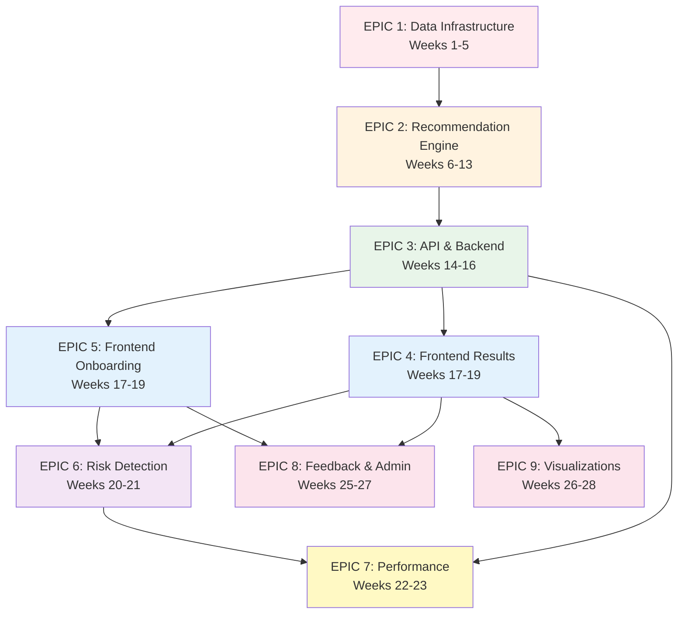

# AI Energy Plan Recommendation Agent - Execution Plan
**Project:** TreeBeard
**Organization:** [COMPANY]
**Created:** 2025-11-10
**Strategy:** Parallelized Multi-Agent Development

---

## Overview

This execution plan organizes the 14 PRs from the PRD into parallelizable work streams. The goal is to maximize concurrent development by identifying dependencies and creating shardable work packages.

**Key Principles:**
- **Parallel Work Streams:** Multiple teams/agents can work simultaneously
- **Clear Interfaces:** Well-defined contracts between components
- **Minimal Dependencies:** Front-load foundational work, then parallelize
- **Agent Specialization:** Match work to appropriate subagent types

---

## Parallelization Strategy

### Wave 1: Foundation (Weeks 1-5)
**Parallel Capacity:** 2 streams
**Goal:** Establish data layer and core analysis engine

### Wave 2: Core Engine (Weeks 6-13)
**Parallel Capacity:** 3 streams
**Goal:** Build recommendation logic, AI integration, and API layer

### Wave 3: User Experience (Weeks 14-19)
**Parallel Capacity:** 3 streams
**Goal:** Build frontend, onboarding, and results display

### Wave 4: Enhancement (Weeks 20-24)
**Parallel Capacity:** 4 streams
**Goal:** Add risk detection, optimization, analytics, monitoring

### Wave 5: Polish (Weeks 25-28) [Optional]
**Parallel Capacity:** 3 streams
**Goal:** Feedback loops, admin tools, visualizations

---

## Epic Breakdown

### EPIC 1: Data Infrastructure & Pipeline
**Duration:** Weeks 1-5
**Priority:** P0 (Must-Have)
**Lead Agent:** Backend Dev
**Supporting Agents:** Data Engineer, DevOps

**Comprises:**
- PR #1: Core Data Infrastructure & Models
- PR #2: Usage Analysis Engine

**Why Together:** Tightly coupled - analysis engine depends on data models, but can develop schemas and analysis logic in parallel once interfaces are defined.

**Parallelization Approach:**
- **Stream 1A (Backend Dev):** Database schema, ETL pipeline, data validation
- **Stream 1B (Backend Dev):** Usage analysis algorithms, profiling logic

**Interface Contract:**
```python
# Agreed interface between streams
class UsageData:
    user_id: UUID
    monthly_usage: List[MonthlyUsage]
    current_plan: PlanDetails

class UsageAnalyzer:
    def analyze(usage_data: UsageData) -> UserProfile
```

---

### EPIC 2: Recommendation Engine
**Duration:** Weeks 6-13
**Priority:** P0 (Must-Have)
**Lead Agent:** Backend Dev (Algorithm Specialist)
**Supporting Agents:** ML Engineer, Backend Dev

**Comprises:**
- PR #3: Plan Matching Algorithm
- PR #4: Savings & Comparison Calculator
- PR #5: Explanation Generation Engine

**Parallelization Approach:**
- **Stream 2A (Backend Dev):** Plan matching algorithm, scoring system (Weeks 6-9)
- **Stream 2B (Backend Dev):** Savings calculator, cost projections (Weeks 8-10) [Starts Week 8]
- **Stream 2C (ML Engineer):** Explanation engine, Claude API integration (Weeks 11-13)

**Dependencies:**
- Stream 2B requires Stream 2A interface (plan scoring output)
- Stream 2C requires Stream 2A output (top 3 plans)

**Interface Contracts:**
```python
# Stream 2A Output
class RecommendationResult:
    top_plans: List[RankedPlan]  # Top 3
    scores: Dict[UUID, CompositeScore]

# Stream 2B Input
class CostAnalysis:
    def calculate_savings(current: Plan, recommended: Plan, usage: UserProfile) -> SavingsData

# Stream 2C Input
class ExplanationGenerator:
    def generate(plan: RankedPlan, user_prefs: Preferences) -> str
```

---

### EPIC 3: API & Backend Services
**Duration:** Weeks 14-16
**Priority:** P0 (Must-Have)
**Lead Agent:** Backend Dev
**Supporting Agents:** DevOps, Security Engineer

**Comprises:**
- PR #6: API & Backend Services

**Parallelization Approach:**
- **Stream 3A (Backend Dev):** Core API endpoints, routing, validation
- **Stream 3B (Backend Dev):** Authentication, authorization, rate limiting
- **Stream 3C (DevOps):** Redis caching, logging infrastructure

**Work can start in Week 14 while Epic 2 is finishing, using mocked responses.**

**Interface Contracts:**
```python
# API Endpoints (FastAPI)
POST /api/v1/recommendations/generate
GET  /api/v1/recommendations/{userId}
POST /api/v1/users/preferences
GET  /api/v1/plans/catalog
POST /api/v1/usage/upload
```

---

### EPIC 4: Frontend - Results Display
**Duration:** Weeks 17-19
**Priority:** P0 (Must-Have)
**Lead Agent:** Frontend Dev
**Supporting Agents:** UX Designer, Accessibility Specialist

**Comprises:**
- PR #7: Frontend - Recommendation Display UI

**Parallelization Approach:**
- **Stream 4A (Frontend Dev):** Plan card components, savings badges, renewable indicators
- **Stream 4B (Frontend Dev):** Results page layout, comparison view
- **Stream 4C (Frontend Dev):** Cost breakdown displays, mobile responsiveness

**Can work in parallel with Stream 5 (Onboarding) - completely independent.**

---

### EPIC 5: Frontend - Onboarding Flow
**Duration:** Weeks 17-19
**Priority:** P0 (Must-Have)
**Lead Agent:** Frontend Dev
**Supporting Agents:** UX Designer

**Comprises:**
- PR #8: Frontend - Onboarding & Preference Collection

**Parallelization Approach:**
- **Stream 5A (Frontend Dev):** Multi-step form structure, progress indicators, validation
- **Stream 5B (Frontend Dev):** File upload, CSV parsing, data preview
- **Stream 5C (Frontend Dev):** Preference sliders, auto-save, mobile optimization

**Fully parallel with Epic 4 - different pages, no shared components.**

---

### EPIC 6: Quality & Safety Layer
**Duration:** Weeks 20-21
**Priority:** P1 (Should-Have)
**Lead Agent:** Backend Dev
**Supporting Agents:** QA Engineer

**Comprises:**
- PR #9: Risk Detection & Warning System

**Parallelization Approach:**
- **Stream 6A (Backend Dev):** Risk detection rules (ETF, savings, volatility)
- **Stream 6B (Frontend Dev):** Warning UI components, mitigation suggestions

**Can start while Epics 4-5 are finishing.**

---

### EPIC 7: Performance & Observability
**Duration:** Weeks 22-23
**Priority:** P1 (Should-Have)
**Lead Agent:** DevOps
**Supporting Agents:** Backend Dev, Data Analyst

**Comprises:**
- PR #10: Performance Optimization & Caching
- PR #11: Analytics & Monitoring

**Parallelization Approach:**
- **Stream 7A (DevOps):** Caching strategy, CDN setup, database optimization (PR #10)
- **Stream 7B (Data Analyst):** Analytics integration, dashboards, tracking (PR #11)
- **Stream 7C (DevOps):** APM setup, error tracking, alerting (PR #11)

**Highly parallelizable - minimal overlap.**

---

### EPIC 8: User Feedback & Admin Tools [Optional]
**Duration:** Weeks 25-27
**Priority:** P2 (Nice-to-Have)
**Lead Agent:** Fullstack Dev
**Supporting Agents:** Frontend Dev, Backend Dev

**Comprises:**
- PR #12: User Feedback Loop
- PR #13: Admin Dashboard

**Parallelization Approach:**
- **Stream 8A (Fullstack Dev):** Feedback collection UI and API (PR #12)
- **Stream 8B (Fullstack Dev):** Admin dashboard UI (PR #13)
- **Stream 8C (Backend Dev):** Admin API, RBAC, audit logging (PR #13)

**Fully independent work streams.**

---

### EPIC 9: Enhanced Visualizations [Optional]
**Duration:** Weeks 26-28
**Priority:** P2 (Nice-to-Have)
**Lead Agent:** Frontend Dev (Visualization Specialist)

**Comprises:**
- PR #14: Enhanced Visualization & Comparison Tools

**Parallelization Approach:**
- **Stream 9A (Frontend Dev):** Chart components (Chart.js), usage visualizations
- **Stream 9B (Frontend Dev):** Side-by-side comparison, scenario modeling
- **Stream 9C (Frontend Dev):** PDF/CSV export functionality

**Can run fully parallel with Epic 8.**

---

## Dependency Graph



---

## Parallel Execution Waves

### Wave 1: Foundation (Weeks 1-5)
**Concurrent Streams:** 2

| Stream | Epic | Agent Type | Work |
|--------|------|------------|------|
| 1A | Epic 1 | Backend Dev | Database schema, ETL, validation |
| 1B | Epic 1 | Backend Dev | Usage analysis, profiling |

**Deliverable:** Functional data layer with analysis capabilities

---

### Wave 2: Core Logic (Weeks 6-13)
**Concurrent Streams:** 3

| Week | Stream 2A | Stream 2B | Stream 2C |
|------|-----------|-----------|-----------|
| 6-7 | Plan matching algorithm | - | - |
| 8-9 | Plan ranking, optimization | Savings calculator | - |
| 10 | Testing, refinement | Cost projections, breakeven | - |
| 11-13 | Testing integration | Testing integration | Explanation engine, Claude API |

**Deliverable:** Complete recommendation engine (matching + savings + explanations)

---

### Wave 3: User-Facing Layers (Weeks 14-19)
**Concurrent Streams:** 3

| Week | Stream 3 (API) | Stream 4 (Results) | Stream 5 (Onboarding) |
|------|----------------|--------------------|-----------------------|
| 14-16 | API endpoints, auth, caching | - | - |
| 17 | API testing | Plan cards, badges | Form structure |
| 18 | API refinement | Results page | File upload, preferences |
| 19 | Integration | Mobile, accessibility | Auto-save, validation |

**Deliverable:** Working end-to-end flow (onboarding → recommendations → results)

---

### Wave 4: Enhancement (Weeks 20-24)
**Concurrent Streams:** 4

| Week | Stream 6 (Risk) | Stream 7A (Perf) | Stream 7B (Analytics) | Stream 7C (Monitoring) |
|------|-----------------|------------------|-----------------------|------------------------|
| 20-21 | Risk rules, warnings | - | - | - |
| 22 | Testing | Caching, CDN | Event tracking | APM, Sentry |
| 23 | Integration | DB optimization | Dashboards | Alerting |
| 24 | - | Testing | Reports | Testing |

**Deliverable:** Production-ready system with observability

---

### Wave 5: Polish (Weeks 25-28) [Optional]
**Concurrent Streams:** 3

| Week | Stream 8A (Feedback) | Stream 8B (Admin UI) | Stream 9 (Viz) |
|------|----------------------|----------------------|----------------|
| 25-26 | Feedback UI/API | Admin dashboard | Charts |
| 27 | Sentiment analysis | RBAC, audit logs | Comparison tools |
| 28 | Testing | Testing | Export, testing |

**Deliverable:** Enhanced product with admin capabilities

---

## Agent Allocation Matrix

### Primary Agent Types Needed

| Agent Type | Wave 1 | Wave 2 | Wave 3 | Wave 4 | Wave 5 | Total Needed |
|------------|--------|--------|--------|--------|--------|--------------|
| Backend Dev | 2 | 2 | 1 | 1 | 1 | **2-3 concurrent** |
| Frontend Dev | - | - | 2 | 1 | 2 | **2 concurrent** |
| DevOps | - | - | 1 | 2 | - | **1-2 concurrent** |
| ML Engineer | - | 1 | - | - | - | **1** |
| Data Analyst | - | - | - | 1 | - | **1** |
| UX Designer | - | - | 1 | - | - | **1 (supporting)** |
| QA Engineer | - | - | - | 1 | - | **1 (supporting)** |

**Peak Concurrency:** Wave 4 (4 concurrent streams)

---

## Story-Level Breakdown

### EPIC 1: Data Infrastructure & Pipeline

#### Story 1.1: Database Schema Design [Stream 1A]
**Agent:** Backend Dev
**Estimate:** 1 week
**Dependencies:** None

**Tasks:**
- Design `users`, `usage_history`, `current_plans`, `user_preferences` tables
- Design `plan_catalog`, `suppliers` tables
- Design `recommendations`, `recommendation_plans`, `feedback` tables
- Create ER diagram
- Write migration scripts

**Acceptance Criteria:**
- [ ] All tables defined with proper constraints
- [ ] Indexes created for performance
- [ ] Migration scripts execute successfully
- [ ] ER diagram documents relationships

---

#### Story 1.2: ETL Pipeline for Usage Data [Stream 1A]
**Agent:** Backend Dev
**Estimate:** 1.5 weeks
**Dependencies:** Story 1.1 (schema)

**Tasks:**
- CSV parser implementation
- Data validation rules
- Data transformation layer
- Error handling and logging
- Integration tests

**Acceptance Criteria:**
- [ ] Successfully parse CSV with 12 months of usage data
- [ ] Validate data quality (no gaps, valid ranges)
- [ ] Handle missing/invalid data gracefully
- [ ] Store validated data in database

---

#### Story 1.3: Plan Catalog Ingestion [Stream 1A]
**Agent:** Backend Dev
**Estimate:** 1 week
**Dependencies:** Story 1.1 (schema)

**Tasks:**
- Plan data model implementation
- API/file-based ingestion
- Scheduled update mechanism
- Data versioning

**Acceptance Criteria:**
- [ ] Import 50+ plans from source
- [ ] Support multiple rate structures (fixed, variable, tiered)
- [ ] Update existing plans without duplication
- [ ] Track last updated timestamps

---

#### Story 1.4: Usage Pattern Analysis [Stream 1B]
**Agent:** Backend Dev (Data focus)
**Estimate:** 2 weeks
**Dependencies:** Story 1.1 (schema) [can start in parallel]

**Tasks:**
- Seasonal pattern detection algorithm
- Peak/off-peak usage calculation
- User profiling logic (baseline, high, variable)
- 12-month projection algorithm
- Caching layer for computed profiles

**Acceptance Criteria:**
- [ ] Detect summer/winter peaks from historical data
- [ ] Classify users into profile categories
- [ ] Generate accurate 12-month projections
- [ ] Cache profiles with 24-hour TTL

---

#### Story 1.5: Edge Case Handling [Stream 1B]
**Agent:** Backend Dev
**Estimate:** 1 week
**Dependencies:** Story 1.4

**Tasks:**
- Handle incomplete data (<12 months)
- Handle missing months (interpolation)
- Anomaly detection (spikes)
- New customer scenarios
- Data quality flagging

**Acceptance Criteria:**
- [ ] Gracefully handle <12 months of data
- [ ] Interpolate missing months appropriately
- [ ] Flag anomalies for user review
- [ ] Provide confidence scores for projections

---

### EPIC 2: Recommendation Engine

#### Story 2.1: Scoring Algorithm Foundation [Stream 2A]
**Agent:** Backend Dev (Algorithm)
**Estimate:** 1.5 weeks
**Dependencies:** Epic 1 complete

**Tasks:**
- Design multi-factor scoring model
- Implement cost score calculation
- Implement flexibility score
- Implement renewable energy score
- Implement supplier rating score
- Composite scoring formula

**Acceptance Criteria:**
- [ ] Each factor scored on 0-100 scale
- [ ] Composite score applies user preference weights
- [ ] Unit tests for all scoring components
- [ ] Deterministic results for same inputs

---

#### Story 2.2: Plan Matching & Ranking [Stream 2A]
**Agent:** Backend Dev
**Estimate:** 1.5 weeks
**Dependencies:** Story 2.1

**Tasks:**
- Plan filtering by eligibility
- Cost calculation for each plan type
- Apply scoring to all eligible plans
- Ranking algorithm with tie-breaking
- Select top 3 recommendations

**Acceptance Criteria:**
- [ ] Filter plans by region and eligibility
- [ ] Correctly calculate costs for fixed, variable, tiered rates
- [ ] Rank all plans by composite score
- [ ] Return diverse top 3 (different plan types if possible)

---

#### Story 2.3: Contract Timing Optimization [Stream 2A]
**Agent:** Backend Dev
**Estimate:** 1 week
**Dependencies:** Story 2.2

**Tasks:**
- Contract end date checking
- Switching cost calculation (ETF)
- Break-even analysis
- Timing recommendations

**Acceptance Criteria:**
- [ ] Calculate days until current contract end
- [ ] Include ETF in total cost if applicable
- [ ] Calculate break-even point in months
- [ ] Recommend waiting if ETF is prohibitive

---

#### Story 2.4: Savings Calculator [Stream 2B]
**Agent:** Backend Dev
**Estimate:** 1.5 weeks
**Dependencies:** Story 2.2 (needs plan cost calculations)

**Tasks:**
- Annual savings calculation
- Monthly cost breakdown
- Total cost of ownership (TCO)
- Break-even analysis integration
- Variable rate uncertainty handling

**Acceptance Criteria:**
- [ ] Calculate accurate annual savings vs current plan
- [ ] Provide month-by-month cost projection
- [ ] Include all fees in TCO
- [ ] Display uncertainty for variable rates

---

#### Story 2.5: Comparison Features [Stream 2B]
**Agent:** Backend Dev
**Estimate:** 0.5 weeks
**Dependencies:** Story 2.4

**Tasks:**
- Side-by-side comparison data structure
- Savings percentage calculation
- Multi-year projections

**Acceptance Criteria:**
- [ ] Generate comparison data for top 3 plans
- [ ] Calculate both $ and % savings
- [ ] Project savings over contract length

---

#### Story 2.6: Claude API Integration [Stream 2C]
**Agent:** ML Engineer
**Estimate:** 1 week
**Dependencies:** Story 2.2 (needs recommendation output)

**Tasks:**
- Claude API authentication
- Prompt template design
- Request/response handling
- Error handling and retries
- Fallback to template-based explanations

**Acceptance Criteria:**
- [ ] Successfully call Claude API
- [ ] Generate explanations for recommendations
- [ ] Handle API failures gracefully
- [ ] Fall back to templates if API unavailable

---

#### Story 2.7: Explanation Personalization [Stream 2C]
**Agent:** ML Engineer / Backend Dev
**Estimate:** 1 week
**Dependencies:** Story 2.6

**Tasks:**
- Analyze user preferences for messaging
- Persona-based message customization
- Readability optimization (8th grade level)
- Key differentiator highlighting
- Trade-off explanations

**Acceptance Criteria:**
- [ ] Personalize explanations based on user priorities
- [ ] Achieve Flesch-Kincaid readability score >60
- [ ] Highlight why each plan matches user needs
- [ ] Explain trade-offs clearly

---

#### Story 2.8: Explanation Caching [Stream 2C]
**Agent:** Backend Dev
**Estimate:** 0.5 weeks
**Dependencies:** Story 2.7

**Tasks:**
- Cache explanation by plan+profile combination
- Set appropriate TTL
- Cache invalidation strategy

**Acceptance Criteria:**
- [ ] Cache generated explanations in Redis
- [ ] Reduce Claude API calls for repeat scenarios
- [ ] Set 24-hour TTL

---

### EPIC 3: API & Backend Services

#### Story 3.1: API Framework Setup [Stream 3A]
**Agent:** Backend Dev
**Estimate:** 0.5 weeks
**Dependencies:** None (can start earlier)

**Tasks:**
- FastAPI project structure
- Request/response schemas (Pydantic)
- Error handling middleware
- Logging setup
- OpenAPI documentation

**Acceptance Criteria:**
- [ ] FastAPI app running
- [ ] Auto-generated API docs at /docs
- [ ] Structured logging configured
- [ ] Error responses standardized

---

#### Story 3.2: Core Recommendation Endpoint [Stream 3A]
**Agent:** Backend Dev
**Estimate:** 1.5 weeks
**Dependencies:** Epic 2 complete, Story 3.1

**Tasks:**
- POST /api/v1/recommendations/generate implementation
- Request validation
- Integration with recommendation engine
- Response formatting
- Error handling

**Acceptance Criteria:**
- [ ] Accept user data, usage data, preferences
- [ ] Return top 3 recommendations with explanations
- [ ] Response time <2 seconds (P95)
- [ ] Proper error responses for invalid input

---

#### Story 3.3: Supporting Endpoints [Stream 3A]
**Agent:** Backend Dev
**Estimate:** 1 week
**Dependencies:** Story 3.2

**Tasks:**
- GET /api/v1/recommendations/{userId}
- POST /api/v1/users/preferences
- GET /api/v1/plans/catalog
- POST /api/v1/usage/upload
- Pagination for catalog

**Acceptance Criteria:**
- [ ] All endpoints functional
- [ ] Proper validation
- [ ] Pagination for large datasets
- [ ] Integration tests pass

---

#### Story 3.4: Authentication & Authorization [Stream 3B]
**Agent:** Backend Dev (Security focus)
**Estimate:** 1.5 weeks
**Dependencies:** Story 3.1

**Tasks:**
- JWT token generation and validation
- User registration/login endpoints
- Protected route middleware
- Refresh token logic
- Role-based access control (RBAC)

**Acceptance Criteria:**
- [ ] Users can register and login
- [ ] JWT tokens issued with 24-hour expiration
- [ ] Protected endpoints require valid token
- [ ] RBAC supports user, admin, partner roles

---

#### Story 3.5: Rate Limiting [Stream 3B]
**Agent:** Backend Dev
**Estimate:** 0.5 weeks
**Dependencies:** Story 3.4

**Tasks:**
- Rate limiting middleware
- 100 requests/min per user limit
- Rate limit headers in response
- 429 Too Many Requests handling

**Acceptance Criteria:**
- [ ] Rate limits enforced per user
- [ ] Proper headers returned
- [ ] Graceful 429 responses

---

#### Story 3.6: Caching Layer [Stream 3C]
**Agent:** DevOps / Backend Dev
**Estimate:** 1 week
**Dependencies:** Story 3.1

**Tasks:**
- Redis connection setup
- Cache middleware
- Plan catalog caching (1 hour TTL)
- Recommendation caching (24 hour TTL)
- Cache invalidation logic

**Acceptance Criteria:**
- [ ] Redis cluster connected
- [ ] Cache hits return <500ms
- [ ] Proper TTL configuration
- [ ] Cache invalidation on data updates

---

#### Story 3.7: Logging & Monitoring Setup [Stream 3C]
**Agent:** DevOps
**Estimate:** 1 week
**Dependencies:** Story 3.1

**Tasks:**
- Structured logging (JSON format)
- CloudWatch/Stackdriver integration
- Performance metric logging
- Request/response logging
- Log rotation

**Acceptance Criteria:**
- [ ] All logs in JSON format
- [ ] Logs aggregated in CloudWatch
- [ ] Performance metrics tracked
- [ ] Log retention policy configured

---

### EPIC 4: Frontend - Results Display

#### Story 4.1: Design System & Component Library [Stream 4A]
**Agent:** Frontend Dev
**Estimate:** 1 week
**Dependencies:** None

**Tasks:**
- Setup React + TypeScript project
- Configure Tailwind CSS
- Define color palette and typography
- Create base components (Button, Card, Badge)
- Storybook setup

**Acceptance Criteria:**
- [ ] React app running
- [ ] Tailwind configured with custom theme
- [ ] Base components in Storybook
- [ ] Responsive design foundation

---

#### Story 4.2: Plan Card Component [Stream 4A]
**Agent:** Frontend Dev
**Estimate:** 1.5 weeks
**Dependencies:** Story 4.1

**Tasks:**
- Plan card layout design
- Savings badge component
- Renewable energy indicator
- Expandable "Why this plan?" section
- Hover effects and interactions

**Acceptance Criteria:**
- [ ] Plan card displays all key info
- [ ] Savings badge color-coded by amount
- [ ] Renewable % visual indicator
- [ ] Explanation expands smoothly
- [ ] Responsive on mobile

---

#### Story 4.3: Results Page Layout [Stream 4B]
**Agent:** Frontend Dev
**Estimate:** 1.5 weeks
**Dependencies:** Story 4.2

**Tasks:**
- Results page structure
- Display top 3 plan cards
- Summary header (total savings)
- "Also considered" section
- Empty state and error handling

**Acceptance Criteria:**
- [ ] Top 3 plans displayed in cards
- [ ] Summary shows total potential savings
- [ ] Responsive grid layout
- [ ] Error states handled gracefully

---

#### Story 4.4: Cost Breakdown Component [Stream 4B]
**Agent:** Frontend Dev
**Estimate:** 1 week
**Dependencies:** Story 4.2

**Tasks:**
- Cost breakdown table/accordion
- Monthly cost projection display
- Tooltip explanations
- Collapsible details

**Acceptance Criteria:**
- [ ] Shows energy charges, fees, total
- [ ] Month-by-month breakdown
- [ ] Tooltips explain each cost
- [ ] Clean, readable formatting

---

#### Story 4.5: Mobile Responsiveness [Stream 4C]
**Agent:** Frontend Dev
**Estimate:** 1 week
**Dependencies:** Story 4.3, 4.4

**Tasks:**
- Mobile layout optimization
- Touch interaction testing
- Card stacking on small screens
- Navigation adjustments

**Acceptance Criteria:**
- [ ] Works on 320px width (iPhone SE)
- [ ] Touch targets ≥44px
- [ ] Readable text on mobile
- [ ] Tested on iOS and Android

---

#### Story 4.6: Accessibility Implementation [Stream 4C]
**Agent:** Frontend Dev (A11y specialist)
**Estimate:** 1 week
**Dependencies:** Story 4.3, 4.4

**Tasks:**
- ARIA labels for all components
- Keyboard navigation
- Focus indicators
- Screen reader testing
- Color contrast verification (WCAG AA)

**Acceptance Criteria:**
- [ ] Full keyboard navigation works
- [ ] Screen reader announces all content
- [ ] Color contrast ratio ≥4.5:1
- [ ] Axe DevTools reports no violations

---

### EPIC 5: Frontend - Onboarding Flow

#### Story 5.1: Multi-Step Form Framework [Stream 5A]
**Agent:** Frontend Dev
**Estimate:** 1 week
**Dependencies:** Story 4.1 (design system)

**Tasks:**
- Multi-step form structure
- Progress indicator component
- Step navigation (Next/Back)
- Form state management (React Hook Form)
- Validation library setup (Yup/Zod)

**Acceptance Criteria:**
- [ ] 4-step form navigable
- [ ] Progress bar shows current step
- [ ] Validation prevents invalid progression
- [ ] State persists across steps

---

#### Story 5.2: User Info & Current Plan Forms [Stream 5A]
**Agent:** Frontend Dev
**Estimate:** 1 week
**Dependencies:** Story 5.1

**Tasks:**
- Step 1: User information (email, ZIP)
- Step 2: Current plan details
- Field validation (email, ZIP format)
- Inline error messages
- Help text and tooltips

**Acceptance Criteria:**
- [ ] All fields validated on blur
- [ ] Inline errors displayed clearly
- [ ] Required fields enforced
- [ ] Tooltips explain unclear fields

---

#### Story 5.3: File Upload Component [Stream 5B]
**Agent:** Frontend Dev
**Estimate:** 1.5 weeks
**Dependencies:** Story 5.1

**Tasks:**
- Drag-and-drop upload zone
- File browser integration
- CSV parsing (client-side preview)
- File validation (type, size)
- Upload progress indicator
- Manual entry alternative (12 inputs)

**Acceptance Criteria:**
- [ ] Drag-and-drop works
- [ ] Preview shows first 5 rows
- [ ] Validate CSV format
- [ ] Show upload progress
- [ ] Manual entry option available

---

#### Story 5.4: Preference Selection UI [Stream 5B]
**Agent:** Frontend Dev
**Estimate:** 1 week
**Dependencies:** Story 5.1

**Tasks:**
- 4 preference sliders (cost, flexibility, renewable, rating)
- Auto-adjust to sum to 100%
- Preset profiles (budget, eco, balanced)
- Visual feedback (highlight dominant preference)

**Acceptance Criteria:**
- [ ] Sliders sum to 100% always
- [ ] Preset buttons apply correct weights
- [ ] Visual feedback shows preference distribution
- [ ] Smooth slider interactions

---

#### Story 5.5: Auto-Save & Restore [Stream 5C]
**Agent:** Frontend Dev
**Estimate:** 0.5 weeks
**Dependencies:** Story 5.2, 5.3, 5.4

**Tasks:**
- Auto-save to localStorage on field change
- Debounce saves (500ms)
- Restore on page reload
- Save indicator ("Saved" checkmark)
- Clear data on submission

**Acceptance Criteria:**
- [ ] Data persists on page reload
- [ ] Save indicator shows status
- [ ] Data cleared after successful submit
- [ ] No data loss during session

---

#### Story 5.6: Form Submission & Loading States [Stream 5C]
**Agent:** Frontend Dev
**Estimate:** 1 week
**Dependencies:** Epic 3 (API), Story 5.5

**Tasks:**
- Form submission handler
- Loading screen with spinner
- Success screen
- Redirect to results page
- Error handling

**Acceptance Criteria:**
- [ ] Submit sends data to API
- [ ] Loading screen shows progress
- [ ] Success message displayed
- [ ] Redirect to results after 2 seconds
- [ ] Errors handled with retry option

---

### EPIC 6: Quality & Safety Layer

#### Story 6.1: Risk Detection Rules [Stream 6A]
**Agent:** Backend Dev
**Estimate:** 1 week
**Dependencies:** Epic 2 complete

**Tasks:**
- High ETF detection (>$150)
- Low savings detection (<5%)
- Data quality issue flagging
- Variable rate volatility check
- Contract length misalignment
- Supplier reliability check

**Acceptance Criteria:**
- [ ] All risk rules implemented
- [ ] Risk scores calculated
- [ ] Warnings generated with context
- [ ] Unit tests for each rule

---

#### Story 6.2: "Stay with Current Plan" Logic [Stream 6A]
**Agent:** Backend Dev
**Estimate:** 0.5 weeks
**Dependencies:** Story 6.1

**Tasks:**
- Compare net benefit of switching
- Define "stay" thresholds
- Generate stay recommendation
- Explanation for staying

**Acceptance Criteria:**
- [ ] Recommends staying if switching not worthwhile
- [ ] Explains why staying is better
- [ ] Suggests revisiting at contract end

---

#### Story 6.3: Warning UI Components [Stream 6B]
**Agent:** Frontend Dev
**Estimate:** 1 week
**Dependencies:** Story 6.1, Epic 4 (frontend)

**Tasks:**
- Warning banner component
- Severity color coding (info, warning, critical)
- Expandable warning details
- Mitigation suggestions display

**Acceptance Criteria:**
- [ ] Warnings display prominently
- [ ] Color-coded by severity
- [ ] Expandable for more details
- [ ] Mitigation actions clear

---

### EPIC 7: Performance & Observability

#### Story 7.1: Redis Caching Optimization [Stream 7A]
**Agent:** DevOps
**Estimate:** 1 week
**Dependencies:** Epic 3 (Redis already setup)

**Tasks:**
- Cache hit rate monitoring
- Cache warming strategy
- TTL optimization
- Cache invalidation testing
- Memory usage monitoring

**Acceptance Criteria:**
- [ ] Cache hit rate >80%
- [ ] Popular plans pre-cached
- [ ] TTL values optimized
- [ ] Memory usage stable

---

#### Story 7.2: Database Query Optimization [Stream 7A]
**Agent:** Backend Dev
**Estimate:** 1 week
**Dependencies:** Epic 1 (database)

**Tasks:**
- Analyze slow queries
- Add missing indexes
- Optimize N+1 queries
- Connection pooling optimization
- Query result pagination

**Acceptance Criteria:**
- [ ] All queries <100ms (P95)
- [ ] Indexes on all frequently queried fields
- [ ] No N+1 query problems
- [ ] Connection pool stable

---

#### Story 7.3: CDN Setup [Stream 7A]
**Agent:** DevOps
**Estimate:** 0.5 weeks
**Dependencies:** Epic 4 (frontend)

**Tasks:**
- CloudFront/Cloud CDN configuration
- Asset caching (images, CSS, JS)
- Cache busting strategy
- HTTPS setup

**Acceptance Criteria:**
- [ ] Static assets served from CDN
- [ ] 1-year cache for versioned assets
- [ ] HTTPS enforced
- [ ] Fast global delivery

---

#### Story 7.4: Analytics Integration [Stream 7B]
**Agent:** Data Analyst
**Estimate:** 1 week
**Dependencies:** Epic 3, Epic 4

**Tasks:**
- Google Analytics or Mixpanel setup
- Event tracking implementation
- User journey tracking
- Conversion funnel setup
- GDPR-compliant anonymization

**Acceptance Criteria:**
- [ ] Page views tracked
- [ ] User events captured
- [ ] Conversion funnel defined
- [ ] No PII in analytics

---

#### Story 7.5: Business Metrics Dashboard [Stream 7B]
**Agent:** Data Analyst
**Estimate:** 1 week
**Dependencies:** Story 7.4

**Tasks:**
- Key metrics dashboard (Grafana/Tableau)
- Conversion rate tracking
- Average savings metric
- NPS tracking setup
- Weekly automated reports

**Acceptance Criteria:**
- [ ] Dashboard shows key metrics
- [ ] Real-time updates
- [ ] Weekly reports automated
- [ ] Accessible to stakeholders

---

#### Story 7.6: APM Setup [Stream 7C]
**Agent:** DevOps
**Estimate:** 1 week
**Dependencies:** Epic 3 (API)

**Tasks:**
- DataDog or New Relic setup
- Distributed tracing
- API latency monitoring
- Error rate tracking
- Resource utilization monitoring

**Acceptance Criteria:**
- [ ] All API calls traced
- [ ] Latency metrics (P50, P95, P99) tracked
- [ ] Bottlenecks identified
- [ ] Real-time dashboards

---

#### Story 7.7: Error Tracking & Alerting [Stream 7C]
**Agent:** DevOps
**Estimate:** 1 week
**Dependencies:** Epic 3

**Tasks:**
- Sentry setup
- Error grouping configuration
- Alert rules (critical errors)
- PagerDuty/Slack integration
- Source map uploads

**Acceptance Criteria:**
- [ ] All errors captured in Sentry
- [ ] Critical errors alert immediately
- [ ] Errors grouped intelligently
- [ ] Source maps for debugging

---

### EPIC 8: User Feedback & Admin Tools [Optional]

#### Story 8.1: Feedback Collection UI [Stream 8A]
**Agent:** Fullstack Dev
**Estimate:** 1 week
**Dependencies:** Epic 4

**Tasks:**
- Star rating component
- Optional text feedback form
- Feedback submission
- Thank you message

**Acceptance Criteria:**
- [ ] Users can rate recommendations
- [ ] Optional text feedback collected
- [ ] Thank you message displayed
- [ ] Non-intrusive placement

---

#### Story 8.2: Feedback API & Storage [Stream 8A]
**Agent:** Backend Dev
**Estimate:** 0.5 weeks
**Dependencies:** Story 8.1

**Tasks:**
- POST /api/v1/feedback endpoint
- Feedback database schema
- Rate limiting for feedback
- Sentiment analysis (optional)

**Acceptance Criteria:**
- [ ] Feedback stored in database
- [ ] Linked to recommendations
- [ ] Rate limiting prevents spam
- [ ] Sentiment scored (if implemented)

---

#### Story 8.3: Feedback Analytics Dashboard [Stream 8A]
**Agent:** Fullstack Dev
**Estimate:** 0.5 weeks
**Dependencies:** Story 8.2

**Tasks:**
- Average rating display
- Feedback volume chart
- Sentiment distribution
- Filter by plan, date, rating

**Acceptance Criteria:**
- [ ] Dashboard shows key feedback metrics
- [ ] Filterable by various dimensions
- [ ] Identifies trends over time

---

#### Story 8.4: Admin Dashboard UI [Stream 8B]
**Agent:** Frontend Dev
**Estimate:** 2 weeks
**Dependencies:** Epic 3 (API)

**Tasks:**
- Admin dashboard layout
- Plan catalog management UI
- User search and detail view
- System health display
- Analytics overview

**Acceptance Criteria:**
- [ ] CRUD operations for plans
- [ ] User search functional
- [ ] System health visible
- [ ] Role-based UI hiding

---

#### Story 8.5: Admin API & RBAC [Stream 8C]
**Agent:** Backend Dev
**Estimate:** 1.5 weeks
**Dependencies:** Epic 3

**Tasks:**
- Admin authentication
- RBAC implementation (admin, support, analyst roles)
- Plan CRUD endpoints
- User management endpoints
- Audit logging

**Acceptance Criteria:**
- [ ] Admins can log in separately
- [ ] Roles enforced at API level
- [ ] All admin actions logged
- [ ] Audit log queryable

---

#### Story 8.6: Audit Logging & Compliance [Stream 8C]
**Agent:** Backend Dev
**Estimate:** 1 week
**Dependencies:** Story 8.5

**Tasks:**
- Audit log database schema
- Log all admin actions
- Audit log viewer
- Export audit logs (CSV)
- Retention policy

**Acceptance Criteria:**
- [ ] All admin actions logged
- [ ] Logs include timestamp, user, action, resource
- [ ] Logs viewable and filterable
- [ ] Export for compliance

---

### EPIC 9: Enhanced Visualizations [Optional]

#### Story 9.1: Chart Library Setup [Stream 9A]
**Agent:** Frontend Dev
**Estimate:** 0.5 weeks
**Dependencies:** Epic 4

**Tasks:**
- Choose chart library (Chart.js, Recharts)
- Setup and configuration
- Responsive chart wrapper
- Accessibility for charts (alt text, data tables)

**Acceptance Criteria:**
- [ ] Chart library integrated
- [ ] Responsive by default
- [ ] Accessible alternatives provided

---

#### Story 9.2: Usage Visualization [Stream 9A]
**Agent:** Frontend Dev
**Estimate:** 1 week
**Dependencies:** Story 9.1

**Tasks:**
- Monthly usage bar chart
- Seasonal pattern highlighting
- Average line overlay
- Hover tooltips

**Acceptance Criteria:**
- [ ] Bar chart shows 12 months of usage
- [ ] Summer/winter peaks highlighted
- [ ] Tooltips show kWh and % above/below average
- [ ] Responsive and accessible

---

#### Story 9.3: Cost Projection Charts [Stream 9A]
**Agent:** Frontend Dev
**Estimate:** 1 week
**Dependencies:** Story 9.1

**Tasks:**
- Annual cost line chart (current vs recommended)
- Cumulative savings chart
- Break-even point marker
- Legend with toggles

**Acceptance Criteria:**
- [ ] Line chart shows monthly costs for multiple plans
- [ ] Cumulative savings visualized
- [ ] Break-even point marked clearly
- [ ] Legend allows show/hide lines

---

#### Story 9.4: Side-by-Side Comparison [Stream 9B]
**Agent:** Frontend Dev
**Estimate:** 1 week
**Dependencies:** Epic 4

**Tasks:**
- Comparison table component
- Plan selection (checkboxes, max 3)
- Attribute comparison with visual indicators
- "Better/worse" color coding

**Acceptance Criteria:**
- [ ] Select up to 3 plans for comparison
- [ ] Table shows key attributes side-by-side
- [ ] Visual indicators for better/worse values
- [ ] Clear comparison button

---

#### Story 9.5: Scenario Modeling Tool [Stream 9B]
**Agent:** Frontend Dev
**Estimate:** 1 week
**Dependencies:** Epic 2 (recommendation engine)

**Tasks:**
- Usage adjustment slider (+/- 20%)
- Real-time cost recalculation
- Preset scenarios (EV, solar, etc.)
- Reset button

**Acceptance Criteria:**
- [ ] Slider adjusts usage and recalculates costs
- [ ] Preset scenarios apply correct adjustments
- [ ] Shows impact on recommendations
- [ ] Reset returns to actual usage

---

#### Story 9.6: Export Functionality [Stream 9C]
**Agent:** Frontend Dev
**Estimate:** 1 week
**Dependencies:** Story 9.2, 9.3, 9.4

**Tasks:**
- PDF export (recommendations summary)
- CSV export (comparison data)
- Branding/logo in exports
- Download buttons

**Acceptance Criteria:**
- [ ] PDF includes charts and summary
- [ ] CSV exports all comparison data
- [ ] Branding applied to PDF
- [ ] Downloads work on all browsers

---

## Cross-Cutting Concerns

### DevOps & Infrastructure (Ongoing)

#### Story X.1: CI/CD Pipeline
**Agent:** DevOps
**Estimate:** 1 week
**When:** Week 3-4 (after initial code)

**Tasks:**
- GitHub Actions or GitLab CI setup
- Automated testing on PR
- Automated deployment to staging
- Production deployment with approval

**Acceptance Criteria:**
- [ ] Tests run on every PR
- [ ] Successful PRs deploy to staging
- [ ] Production deployment requires approval
- [ ] Rollback capability

---

#### Story X.2: Infrastructure as Code
**Agent:** DevOps
**Estimate:** 1.5 weeks
**When:** Week 5-6

**Tasks:**
- Terraform configuration
- Database provisioning
- Cache cluster provisioning
- API server provisioning
- Frontend hosting setup

**Acceptance Criteria:**
- [ ] All infrastructure defined in code
- [ ] Dev, staging, prod environments
- [ ] Reproducible deployments
- [ ] Version controlled

---

#### Story X.3: Security Hardening
**Agent:** Security Engineer
**Estimate:** 1 week
**When:** Week 18-19 (before launch)

**Tasks:**
- Security audit
- Penetration testing
- Dependency vulnerability scanning
- OWASP Top 10 validation
- DDoS protection (CloudFlare)
- WAF setup

**Acceptance Criteria:**
- [ ] No critical vulnerabilities
- [ ] OWASP Top 10 mitigated
- [ ] DDoS protection enabled
- [ ] Security headers configured

---

#### Story X.4: Compliance & Legal
**Agent:** Legal/Compliance
**Estimate:** 1 week
**When:** Week 19 (before launch)

**Tasks:**
- GDPR compliance review
- Privacy policy
- Terms of service
- Cookie consent implementation
- Data retention policies

**Acceptance Criteria:**
- [ ] GDPR compliant
- [ ] Privacy policy published
- [ ] Terms of service accepted by users
- [ ] Cookie consent implemented

---

## Agent Handoff Protocol

To enable smooth multi-agent collaboration:

### 1. Interface Contracts
Each story that feeds into another stream MUST publish:
- **Data schemas** (Pydantic models, TypeScript interfaces)
- **API contracts** (endpoint specs, request/response examples)
- **Mock implementations** (allow dependent streams to start early)

**Example:**
```python
# Story 2.2 publishes this interface for Story 2.4
class RecommendationResult:
    """Output from plan matching algorithm"""
    user_id: UUID
    top_plans: List[RankedPlan]
    all_scores: Dict[UUID, CompositeScore]
    generated_at: datetime
```

### 2. Handoff Document Template
When completing a story that other agents depend on:

```markdown
# Story X.Y Handoff Document

## Completed:
- [Summary of what was implemented]

## Published Interfaces:
- [List of schemas, APIs, or contracts]
- [Links to documentation]

## Mock Implementations:
- [How dependent stories can mock this component]

## Integration Points:
- [Where this integrates with other stories]

## Known Issues/Limitations:
- [Any caveats for downstream consumers]

## Next Steps for Dependent Stories:
- [What can now proceed]
```

### 3. Integration Testing
Stories from different streams that integrate MUST have:
- **Joint integration tests** (owned by one agent, reviewed by both)
- **Scheduled integration checkpoints** (weekly sync)

---

## Risk Mitigation

### Dependency Bottlenecks
**Risk:** Stream 2C (explanations) blocks on Stream 2A (matching)

**Mitigation:**
- Stream 2A publishes schema and mocks by end of Week 6
- Stream 2C starts with mocked data in Week 11
- Integration testing in Week 13

### API Changes Breaking Frontend
**Risk:** Backend changes break frontend expectations

**Mitigation:**
- API schemas versioned (Pydantic models)
- Contract tests between frontend and backend
- OpenAPI spec published and locked per sprint

### Cross-Stream Communication
**Risk:** Agents on different streams get out of sync

**Mitigation:**
- **Daily async standup:** Each agent posts progress, blockers
- **Weekly sync meeting:** All agents on active streams
- **Shared Slack channel:** Real-time questions
- **Living documentation:** Confluence/Notion for handoffs

---

## Success Metrics

### Development Velocity
- **Stories completed per week:** Target 3-4 across all streams
- **Story cycle time:** <1 week average
- **Integration failures:** <10% of merges

### Parallelization Efficiency
- **Concurrent streams active:** Target 3-4 in peak weeks
- **Idle agent time:** <20% (agents waiting on dependencies)
- **Rework due to integration issues:** <15%

### Quality
- **Test coverage:** >80%
- **Critical bugs:** <5 in production
- **Security vulnerabilities:** 0 critical, <5 high

---

## Appendix: Story Dependency Matrix

| Story | Depends On | Blocks | Can Start Week |
|-------|------------|--------|----------------|
| 1.1 (Schema) | None | 1.2, 1.3, 1.4 | 1 |
| 1.2 (ETL) | 1.1 | - | 2 |
| 1.3 (Catalog) | 1.1 | - | 2 |
| 1.4 (Analysis) | 1.1 | 1.5, 2.1 | 2 |
| 1.5 (Edge Cases) | 1.4 | - | 4 |
| 2.1 (Scoring) | Epic 1 | 2.2 | 6 |
| 2.2 (Matching) | 2.1 | 2.3, 2.4, 2.6 | 8 |
| 2.3 (Timing) | 2.2 | - | 10 |
| 2.4 (Savings) | 2.2 | 2.5 | 8 |
| 2.5 (Comparison) | 2.4 | - | 10 |
| 2.6 (Claude API) | 2.2 | 2.7 | 11 |
| 2.7 (Personalization) | 2.6 | 2.8 | 12 |
| 2.8 (Caching) | 2.7 | - | 13 |
| 3.1 (API Setup) | None | 3.2, 3.4, 3.6 | 14 |
| 3.2 (Core Endpoint) | Epic 2, 3.1 | 3.3 | 15 |
| 3.3 (Supporting) | 3.2 | - | 16 |
| 3.4 (Auth) | 3.1 | 3.5 | 14 |
| 3.5 (Rate Limit) | 3.4 | - | 16 |
| 3.6 (Cache) | 3.1 | - | 14 |
| 3.7 (Logging) | 3.1 | - | 14 |
| 4.1 (Design System) | None | 4.2, 5.1 | 17 |
| 4.2 (Plan Card) | 4.1 | 4.3, 4.4 | 18 |
| 4.3 (Results Page) | 4.2 | 4.5, 4.6 | 18 |
| 4.4 (Cost Breakdown) | 4.2 | 4.5, 4.6 | 18 |
| 4.5 (Mobile) | 4.3, 4.4 | - | 19 |
| 4.6 (Accessibility) | 4.3, 4.4 | - | 19 |
| 5.1 (Form Framework) | 4.1 | 5.2, 5.3, 5.4 | 17 |
| 5.2 (User Forms) | 5.1 | 5.5 | 18 |
| 5.3 (File Upload) | 5.1 | 5.5 | 18 |
| 5.4 (Preferences) | 5.1 | 5.5 | 18 |
| 5.5 (Auto-Save) | 5.2, 5.3, 5.4 | 5.6 | 19 |
| 5.6 (Submission) | Epic 3, 5.5 | - | 19 |
| 6.1 (Risk Rules) | Epic 2 | 6.2, 6.3 | 20 |
| 6.2 (Stay Logic) | 6.1 | - | 21 |
| 6.3 (Warning UI) | 6.1, Epic 4 | - | 21 |
| 7.1 (Caching) | Epic 3 | - | 22 |
| 7.2 (DB Optimization) | Epic 1 | - | 22 |
| 7.3 (CDN) | Epic 4 | - | 22 |
| 7.4 (Analytics) | Epic 3, 4 | 7.5 | 22 |
| 7.5 (Dashboard) | 7.4 | - | 23 |
| 7.6 (APM) | Epic 3 | - | 22 |
| 7.7 (Error Tracking) | Epic 3 | - | 22 |

---

**End of Execution Plan**

This plan maximizes parallelization while maintaining clear dependencies and handoff points for multi-agent development.
